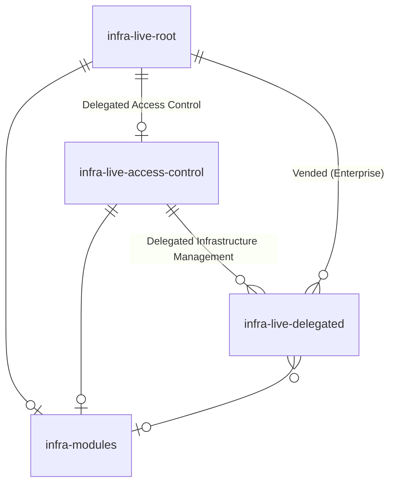

# Architecture

The IaC delivered as part of DevOps Foundations is a fairly flexible. It's designed to allow you to utilize the components you need in order to manage your infrastructure in a way that makes sense for your organization.

Understanding what's included, and how it's structured will give you a better idea of how to use the IaC effectively.

## `infrastructure-live-root`

The `infrastructure-live-root` repository is the root of your infrastructure. It's provisioned using the [infrastructure-live-root-template](https://github.com/gruntwork-io/infrastructure-live-root-template).

This repository is where you'll manage sensitive resources like the Landing Zone and Organization services for AWS. This repository is typically only given access to a small number of trusted users in your organization.

All of the other infrastructure that is managed using Gruntwork software will ultimately rely on something managed in this repository to function.

### Workflows

- **Account Factory** - This workflow provides a convenient API for interacting with Gruntwork Account Factory.

  This workflow uses a [repository dispatch](https://docs.github.com/en/actions/writing-workflows/choosing-when-your-workflow-runs/events-that-trigger-workflows#repository_dispatch) to create a standard AWS account creation request in the repository.

  The payload for the workflow dispatch is a JSON object that can be conveniently constructed using the sample HTML file located next to the workflow file in the repository.

  :::tip

  This HTML file can be customized as needed to fit the needs of your organization. You may want to add additional fields to the form for tagging purposes, or to provide additional context to the person who will be approving the account vend.

  You don't even need to use the form at all if you don't want to. An alternative would be to use a service like ServiceNow to populate the requisite fields, then trigger the workflow using the GitHub API.

  You can learn more about this [here](../../foundations/landing-zone/add-aws-account.md).

  :::

- **Pipelines** - This workflow will be used by the `infrastructure-live-root` repository to manage infrastructure in response to changes in the repository in a GitOps fashion.

  While the permissions for this workflow are largely read-only when proposing infrastructure changes, the workflow will have the ability to make changes to relevant infrastructure when the changes are merged.

:::tip

The `infrastructure-live-root` repository does not have to be named "infrastructure-live-root". You can customize the name during the bootstrap process. It is highly recommended that the repository is named something similar to `infrastructure-live-root` to make it clear what it is when reading Gruntwork documentation, however.

It also doesn't have to be the only root repository in your organization. You can have multiple root repositories if you have a complex organization structure that requires it. Make sure to evaluate the trade-offs of having multiple root repositories before doing so. It can be a significant source of complexity and operational overhead.

:::

## `infrastructure-live-access-control`

The `infrastructure-live-access-control` repository is used to manage access control for your infrastructure. It's provisioned when the "Bootstrap the infrastructure-access-control repository" checkbox is checked when running the Bootstrap workflow in the `infrastructure-live-root` repository.

This repository is only necessary for Enterprise customers, but is recommended for all customers. It's where you'll manage IAM roles, policies, and permissions for *delegated* infrastructure management in your organization.

More access can be granted to this repository than the `infrastructure-live-root` repository, but it should still be treated as a sensitive resource. Organizations typically find it useful to have restrictions on who can approve and merge changes to this repository, and allow for users to propose changes in a self-service fashion. This allows for application workload engineers to propose changes to the access control their workflows need, while allowing a central platform team to review and approve those changes instead of having to author the changes themselves.

:::info

Delegated infrastructure management is the practice of allowing developers to manage infrastructure in a self-service fashion.

This is in contrast to centralized infrastructure management, where a small number of people manage all the infrastructure for the entire organization.

Organizations frequently use a combination of both centralized and delegated infrastructure management to balance the need for control and security with the need for agility and speed.

e.g. Centralized management for core infrastructure like AWS accounts, VPCs, OIDC providers and powerful IAM roles, and delegated management for application infrastructure like container images, AWS ECS services, and S3 buckets.

The exact balance will depend on your organization's needs.

:::

:::tip

The `infrastructure-live-access-control` repository does not have to be named "infrastructure-live-access-control". You can name it whatever you like. It is highly recommended that the repository is named something similar to `infrastructure-live-access-control` to make it clear what it is when reading Gruntwork documentation, however.

It also doesn't have to be the only access control repository in your organization. You can have multiple access control repositories if you have a complex organization structure that requires it. Make sure to evaluate the trade-offs of having multiple access control repositories before doing so. It can be a significant source of complexity and operational overhead. Also note that doing this will sacrifice some of the benefits of having a single source of truth for access control.

:::

### Workflows

- **Pipelines** - This workflow will be used by the `infrastructure-live-access-control` repository to manage access control infrastructure in response to changes in the repository in a GitOps fashion.

  While the permissions for this workflow are largely read-only when proposing access control changes, the workflow also has the ability to make changes to relevant access control infrastructure when the changes are merged.

## `infrastructure-modules`

The `infrastructure-modules` repository is used to store OpenTofu/Terraform modules that your organization has authored and intends to use within your organization. It's provisioned when the "Bootstrap the infrastructure-modules repository" checkbox is checked when running the Bootstrap workflow in the `infrastructure-live-root` repository.

This repository is optional, but is recommended for all customers. It's where you'll store reusable infrastructure code that can be shared across your organization.

A common pattern used by customers is to leverage the Gruntwork IaC library whenever possible, and to author custom modules here if there's ever a need to extend or modify the behavior of Gruntwork modules.

:::tip

The `infrastructure-modules` repository does not have to be named "infrastructure-modules". You can customize the name during the bootstrap process. It is highly recommended that the repository is named something similar to `infrastructure-modules` to make it clear what it is when reading Gruntwork documentation, however.

It also doesn't have to be the only modules repository in your organization. You can have multiple modules repositories if you have a complex organization structure that requires it. Make sure to evaluate the trade-offs of having multiple modules repositories before doing so. It can be advantageous to have one repository for all modules to make it easier to find and share modules across your organization. However, it can also be advantageous to have multiple repositories if you have different teams that need to manage their own modules, or want to have different modules available to different teams within your organization.

:::

### Workflows

- **Tests** - This workflow will be used by the `infrastructure-modules` repository to run tests on the modules in the repository. This workflow is typically run on every push to ensure that the modules are functioning as expected by provisioning them in real environments, running [Terratests](https://github.com/gruntwork-io/terratest) against them, then tearing them down.

  The configurations for this workflow are configured out of the box to run tests on the examples written in the repository.

## `infrastructure-live-delegated`

One of the primary benefits of IaC Foundations is the streamlined delegation of infrastructure management. For the sake of discussion in Gruntwork documentation, we refer to repositories that have been granted delegated permissions to interact with infrastructure as "delegated repositories", or `infrastructure-live-delegated`. Their permissions are granted by the `infrastructure-live-access-control` repository.

These repositories can be created manually by customers for specific purposes. For example, an application repository may need permissions to build and push a container image to AWS ECR, or to deploy an update to an ECS service. These permissions can be delegated by the `infrastructure-live-access-control` repository to a specific repository that needs those permissions.

Enterprise customers can also expect the creation and management of delegated repositories centrally in the `infrastructure-live-root` repository. This is an Enterprise-only feature that allows for the creation of delegated repositories with largely the same degree of infrastructure management as the `infrastructure-live-root` repository itself. This is useful for organizations that want to allow large degrees of infrastructure management (e.g. entire AWS accounts) without having to manually provision and manage the repositories that need those permissions.

## Entity Relationship Diagram

:::note

`infrastructure` is shortened to `infra` in the diagram for brevity.

:::

The central `infrastructure-live-root` repository is the root of all infrastructure management.

If users opt-in to delegating access control to the `infrastructure-live-access-control` repository, they can provision the relevant `pipelines-access-control` roles in AWS accounts where they want to delegate access control using the `infrastructure-live-root` repository, then manage access control using those roles in the `infrastructure-live-access-control` repository.

If users opt-in to delegating infrastructure management to the `infrastructure-live-delegated` repositories, they can provision the relevant `pipelines-delegated` roles in AWS accounts where they want to delegate infrastructure management using the `infrastructure-live-access-control` repository, then manage infrastructure using those roles in the `infrastructure-live-delegated` repositories.

If users opt-in to creating and managing modules centrally, they can create and manage modules in the `infrastructure-modules` repository. This repository can be used by any repository in the organization to share reusable, vetted modules.

