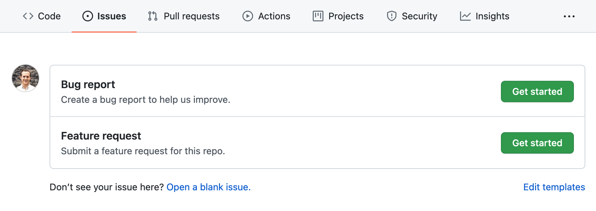

Gruntwork develops both open source and private software products. Contributions from our customers and the community
are very welcome! Please check out the following Contribution Guidelines for instructions.

## Contribution Guidelines

We follow a fairly standard pull request process for contributions, subject to the following guidelines:

1. Types of Contributions
1. File a GitHub Issue First
2. Making a Change
3. Making a New Release

## Types of Contributions

Broadly speaking, we accept two types of contributions:

1. **Bugs:** Bug fixes include any patches or changes that correct unwanted behavior.
2. **New Features:** New features or improvements introduce new functionality.

## File a GitHub Issue First

Before writing any code, you will need to file a GitHub issue if one doesn't exist already. We use GitHub issue
templates so please select the appropriate type when creating your issue.

Also, ensure you apply the appropriate labels to the issue e.g: `in-progress`. **Note:** In the future, we will use
a bot that will automatically add a needs-triage label to every new GitHub issue, however, you **must manually add it for
now**. This allows us to prioritize issues accordingly.

## Making a Change

1. **Checkout the repo.** Find the relevant repo where the change should be made and check it out locally using Git.
2. **Create a new branch.** Create a new branch using the following naming convention. Use the `bug/` prefix for bugs and the `feature/` prefix for new features or improvements. Next replace `foo` or `bar`  with a few words that describe the change you're making. The final number should match the issue you've created above. This is important to ensure our automation works correctly and also helps other engineers.
   1. Bug Fix: `bug/foo-123` e.g., `bug/missing-count-param-434`
   2. New Feature: `feature/bar-456`, e.g., `feature/new-vpc-endpoints-955`
3. **Think through the design.** At Gruntwork, we follow [RDD](https://tom.preston-werner.com/2010/08/23/readme-driven-development.html). If you are about to make a major change or introduce a new module, then write up the docs first, stub out `examples` and submit a PR for that. If it turns out the change needs a lot of design first, consider writing an RFC to get early feedback. Once you've written the docs and won internal approval, then you can proceed to the next step and make your changes.
4. **Make your changes!** Go ahead write code and make your changes. **Important:** Because we follow semantic versioning for our modules, it is important to make your changes backwards compatible whenever possible. To understand what we mean, here's a partial list of changes that are backwards incompatible that you should strive to avoid (sometimes, it's unavoidable, of course, but we should aim to minimize this sort of thing):
   1. Deleting or renaming input or output variables.
   2. Deleting or renaming modules.
   3. Deleting or renaming resources in Terraform code.
   4. Removing or renaming input arguments from shell scripts / CLI tools.
   5. Removing support for various Linux distributions from our software.
   6. Removing builders from Packer templates.
5.  **Follow the necessary styleguides.** Here is a list of styleguides we adhere to for each language and tool.
    1. Terraform: [Terraform Style Guide](https://www.gruntwork.io/guides/style%20guides/terraform-style-guide/)
    2. Packer: [HCL Configuration Syntax](https://www.packer.io/docs/templates/hcl_templates/syntax)
    3. Go: [Go style guide](https://www.gruntwork.io/guides/style%20guides/golang-style-guide/)
    4. Bash: [Bash style guide](https://google.github.io/styleguide/shellguide.html)
    5. Python: [PEP8](https://www.python.org/dev/peps/pep-0008/) with [flake8](https://pypi.org/project/flake8/) for static analysis of broken code, PEP8 violations and a few extra style issues. Note: We also rely a tiny bit on the [Google guide](https://google.github.io/styleguide/pyguide.html), mostly for the docstrings (see an [example](https://www.sphinx-doc.org/en/master/usage/extensions/example_google.html)).
6.  **Run the precommit hooks.** Most of our repos contain [precommit hooks](https://pre-commit.com/) which are helpful for identifying simple issues before submitting a pull request (such as `terraform fmt` or `goimports`). We also use them to meet various coding standards. Typically you can run the hooks locally using the following command: `pre-commit run --verbose --all-files`.
7.  **Run the tests!** When you are finished, be sure to run all of the tests. Typically, there are instructions in the root `README.md` in the `test` folder. Note: if you are adding a new feature, then you must add the relevant tests. Likewise if you are fixing a bug then we strongly recommend adding a regression test is possible.

### Submitting a Pull Request

When you are ready to submit your change, you should open a GitHub pull request by pushing your branch to the relevant
repo. Because we use GitHub pull request templates you will notice that an example template is automatically added.

Be sure to add the relevant information, then click 'Create Pull Request'.

**Important**: If your pull request is still a work in progress then please amend the title to include the text `[WIP]`
at the beginning so it is ignored by humans and automation.

Now that you have submitted your pull request you will need to ask somebody to review it.

### 

**Note:** This section only applies to Gruntwork Staff including employees and contractors.

## Making a New Release

**Note:** This section only applies to Gruntwork Staff including employees and contractors. Please refer to the
[following internal document](https://www.notion.so/gruntwork/Coding-Methodology-RFC-02fdcd6e4b004e818553684760bf691e#08b68ee0e19143e89523dcf483d2bf48).
