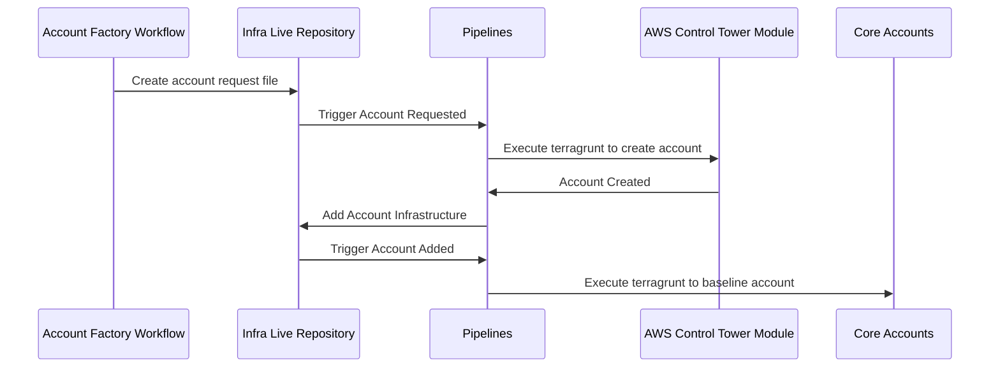

# Account Factory Architecture

## Overview

Account Factory builds upon Gruntwork's [AWS Control Tower Multi Account Factory](/reference/modules/terraform-aws-control-tower/control-tower-multi-account-factory/) and Pipelines to provide automated account creation, baselining, and managed IAM policies.

In your `infrastructure-live-root` repository, the `_new-account-requests` directory acts as input for the Gruntwork Control Tower Module. This module runs within your management account and uses AWS Control Tower to provision new accounts.

Pipelines tracks each provisioned account as a new base directory containing Terragrunt units in your `infrastructure-live-root` repository.

## Account Vending

Account Vending starts when the Account Factory Workflow generates a Pull Request against `infrastructure-live-root`, adding a file to the `_new-account-requests` directory. Pipelines detects these new account requests and runs terragrunt plan/apply commands on this module in the management account.

After creating the account, Pipelines provisions resources, including IaC-controlled OIDC authentication, which Pipelines uses to deploy infrastructure changes within the account, and IAM policies that define the scope of changes Pipelines can deploy.

After adding this infrastructure to the repository, Pipelines deploys the resources into the AWS account and runs account baselines in the logs, security, and shared accounts to complete the provisioning process.

## IAM Roles

Each new account includes IAM policies that define the scope of changes Pipelines can make within AWS. Pipelines automatically assumes the appropriate roles for each account when changes are detected. Read about the [roles in full here](/2.0/docs/pipelines/architecture/security-controls#roles-provisioned-by-devops-foundations).

## Delegated Repositories

Delegated repositories expand the architecture and provide additional control over your infrastructure. When vending delegated repositories, Pipelines continues tracking new account security baselines in your `infrastructure-live-root` repository, while other infrastructure is tracked in a new repository specific to the account or accounts. Pipelines inherits new IAM roles from your `infrastructure-live-access-control` repository when deploying infrastructure in delegated repositories. This setup allows the central platform team to control what changes Pipelines can implement in the delegated repository.

