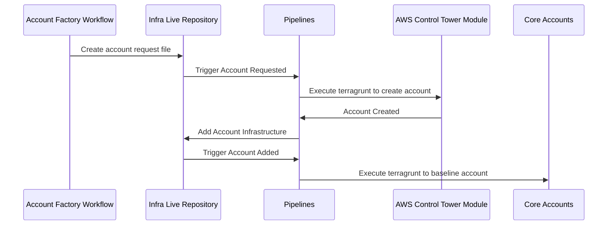

# Account Factory Architecture

## Overview

Account Factory builds upon Gruntwork's [AWS Control Tower Multi Account Factory](/reference/modules/terraform-aws-control-tower/control-tower-multi-account-factory/) and Pipelines to provide automated account creation, baselining, and managed IAM policies.

Within your `infrastructure-live-root` account, the `_new-account-requests` directory serves as an input to the Gruntwork Control Tower Module. This module runs within your management account and uses AWS Control Tower to provision new accounts.

Each provisioned account is tracked in your `infrastructure-live-root` repository as a new base directory containing Terragrunt units that are automatically tracked by Pipelines.

## Account Vending

Account Vending begins by using the Account Factory Workflow to generate a Pull Request against `infrastructure-live-root` that adds a file to the `_new-account-requests` directory. Pipelines detects these new account requests and begins executing terragrunt plan/apply on this module in the management account.

Once the account has been created Pipelines can begin provisioning resources into the account, this includes the IaC controlled OIDC authentication Pipelines will use to deploy infrastructure changes within the account, and IAM policies used to restrict the scope of changes that Pipelines can deploy.

Once this infrastructure has been added to the repository Pipelines deploys it into the AWS account, and runs account baselines in the logs, security, and shared accounts to finish provisioning the new account.

## IAM Roles

Each new account has a set of IAM policies that determine the scope of changes Pipelines can plan/apply within AWS. Pipelines will automatically assume the appropriate roles for each account when changes are detected. Read about the [roles in full here](/2.0/docs/pipelines/architecture/security-controls#roles-provisioned-by-devops-foundations).

## Delegated Repositories

Delegated repositories provide additional control over your infrastructure by expanding on the above architecture. When vending delegated repositories new account security baselines are still tracked in your `infrastructure-live-root` repository, however other infrastructure is tracked in a new repository specific to this account(s). New IAM roles are added to your `infrastructure-live-access-control` repository that control the allowed infrastructure changes that can take place via Pipelines in the delegated repository.

