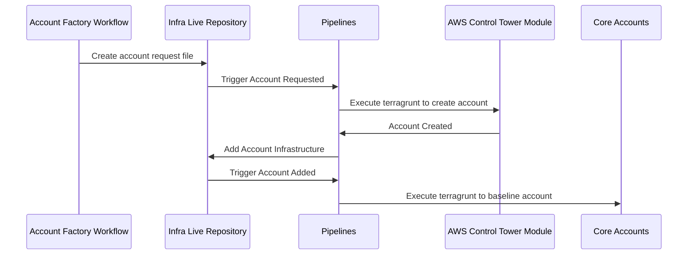

# Account Factory Architecture

## Overview

Account Factory uses Gruntwork's [AWS Control Tower Multi Account Factory](/reference/modules/terraform-aws-control-tower/control-tower-multi-account-factory/) and Pipelines to automate account creation, baselining, and IAM policy management.

In your `infrastructure-live-root` repository, the `_new-account-requests` directory acts as input for the Gruntwork Control Tower Module. The module, functioning within your management account, employs AWS Control Tower to efficiently provision new accounts and manage existing ones.

Pipelines tracks each provisioned account as a new base directory containing Terragrunt units in your `infrastructure-live-root` repository.

## Account vending

Account vending begins when the Account Factory Workflow creates a pull request in `infrastructure-live-root`, adding a file to the `_new-account-requests` directory. Pipelines detects these new account requests and runs terragrunt plan/apply commands on the `control-tower-multi-account-factory` unit in the management account.

After creating the account(s), Pipelines provisions resources such as IaC-controlled OIDC-authenticated roles. These roles, combined with IAM policies that define the scope of permissible changes, allow Pipelines to deploy infrastructure updates within the account.

Once this infrastructure is added to the repository, Pipelines deploys the resources into the AWS account and runs account baselines in the logs, security, and shared accounts to complete the provisioning process.

## IAM roles

Newly created accounts include IAM policies that define the scope of changes Pipelines is authorized to perform within AWS. Pipelines automatically assumes the necessary roles for each account when it detects changes. Detailed information about the provisioned roles can be found [here](/2.0/docs/pipelines/architecture/security-controls#roles-provisioned-by-devops-foundations).

## Delegated repositories

Delegated repositories enhance the architecture of infrastructure management by introducing additional layers of access control. When delegated repositories are created, Pipelines continues to manage new account security baselines within the `infrastructure-live-root` repository, while other infrastructure resources are managed in a new repository specific to the delegated account(s). 

Pipelines uses IAM roles from the `infrastructure-live-access-control` repository to deploy infrastructure in these delegated repositories. This setup enables the central platform team to define and restrict the scope of changes individual teams can make via Pipelines in delegated repositories.

