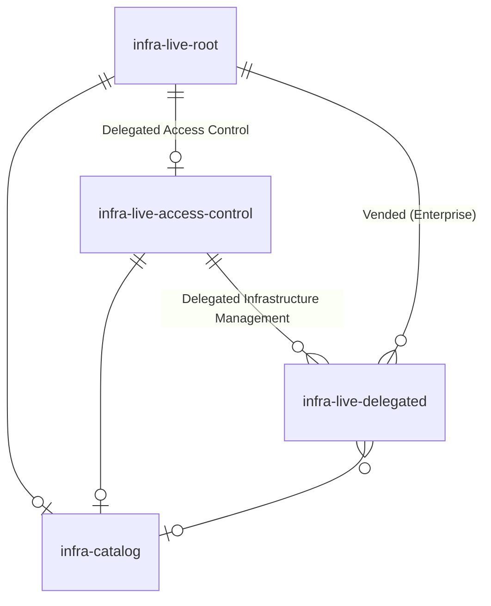

# Repository Topology

Gruntwork Account Factory provides an opinionated (but flexible) repository structure that supports organizations as they scale their infrastructure management across multiple AWS accounts. This approach is designed to help teams graduate from managing a handful of accounts with difficulty to being able to conveniently manage hundreds of accounts, all while maintaining high standards for security, compliance, and developer productivity.

The repository topology is designed around a core principle: **centralized governance with distributed ownership**. Your platform team maintains control over critical security and compliance infrastructure, while application teams get the autonomy they need to move fast within well-defined guardrails.

Understanding this repository structure will help you leverage Account Factory effectively and set your organization up for sustainable growth.

## `infrastructure-live-root`

Think of `infrastructure-live-root` as your organization's infrastructure command center. This repository, built from the [infrastructure-live-root-template](https://github.com/gruntwork-io/infrastructure-live-root-template), is where your platform team manages the foundational elements that every other AWS account depends on, and where your Account Factory workflow lives.

This repository is the only repository with access to the management account, and is granted access to all AWS accounts for your platform team to provision infrastructure in as necessary. This is also where your platform team can provision new AWS accounts with consistent baselines whenever teams need them. You'll also manage critical organization-wide infrastructure like your AWS Landing Zone, central logging, and security services in this repository.

Access to this repository is intentionally restricted to your most trusted platform team members. Every other piece of infrastructure in your organization can trace back to the foundational services configured here.

### `infrastructure-live-root` workflows

- **Account Factory:** (GitHub only) This is your self-service account vending machine. When someone needs a new AWS account (e.g. for a new application, environment, or team), they can trigger this workflow as the entrypoint for the account vending workflow. This workflow is triggered via [repository dispatch](https://docs.github.com/en/actions/writing-workflows/choosing-when-your-workflow-runs/events-that-trigger-workflows#repository_dispatch), which is a feature of GitHub Actions, and makes it possible to trigger the workflow from outside the repository using the GitHub API.

  The workflow accepts a simple JSON payload (there's even a handy customizable HTML form included to make this easy) and creates a pull request with all the necessary infrastructure code to provision and baseline the new account. Organizations typically customize this form to capture additional metadata like additional tags, cost center codes or conditional creation of potentially expensive security services like Macie or GuardDuty.

  :::tip

  The included HTML form is just a starting point. Organizations typically customize this form to capture additional metadata like additional tags, cost center codes or conditional creation of potentially expensive security services like Macie or GuardDuty.

  Once you have a good grasp of how the form works, and how it generates the JSON payload, you can even opt not to use the form at all, and instead trigger the workflow using the GitHub API directly from your internal platforms like ServiceNow or Jira.

  You can learn more about this in the ["Using the Account Factory Workflow" guide](/2.0/docs/accountfactory/guides/vend-aws-account).

  :::

- **Pipelines:** This is where Account Factory integrates with Gruntwork Pipelines to drive infrastructure changes via GitOps workflows. With Gruntwork Pipelines, every infrastructure change goes through a proper review process with pull requests, approvals, and controlled deployments. Your platform team gets the confidence of peer review while maintaining the ability to rapidly deploy critical infrastructure changes.

:::tip

While you can rename `infrastructure-live-root` during setup, keeping the name consistent with our documentation makes life easier for your team. You also *can* create multiple root repositories for complex organizational structures, but be sure that it's worth the additional complexity for your organization. It can be a significant source of operational overhead, and you might be better off delegating some infrastructure management to a separate repository with a [delegated infrastructure-live repository](#infrastructure-live-delegated).

:::

## `infrastructure-live-access-control`

This is where you solve one of the biggest challenges in scaling infrastructure management: **How do you give teams the access they need (and only give them the exact access they need) to manage their own infrastructure?**

The `infrastructure-live-access-control` repository is your organization's permission control center. It manages all the IAM roles, policies, and permissions that determine what each team can do in their AWS accounts outside of the `infrastructure-live-root` repository. It provides a central place where application engineers and the platform team can collaborate to define and iterate on the access control policies for roles that can be assumed by [delegated infrastructure-live repositories](#infrastructure-live-delegated).

Your application teams can propose the access they need here through pull requests, but your platform team maintains oversight by reviewing and approving these changes and branch protection rules can ensure that they have final say in the approval process. No more bottlenecks where platform teams have to manually create every single IAM policy (and determine the appropriate level of access for each team), and no more security risks from teams having overly broad permissions.

:::info

**Delegated infrastructure management** is the practice of allowing developers to manage infrastructure in a self-service fashion.

Instead of having your platform team manually provision every resource required for your entire organization (which doesn't always scale), you can let application teams manage their own infrastructure within clearly defined boundaries. Your platform team still entirely controls critical resources (e.g. AWS accounts, VPCs, security policies) but developers can deploy and update their applications without opening a ticket and waiting on the platform team.

Most organizations find success with a hybrid approach: centralized control for anything that affects security or compliance, delegated management for everything else. Where you draw that line depends on your risk tolerance, team maturity, and the complexity of your organization.

:::

:::tip

You can name the `infrastructure-live-access-control` repository whatever makes sense for your organization. Just keep it descriptive so future team members (and your future self) know exactly what it does. If you can keep the name similar to `infrastructure-live-access-control`, you probably should so that it's easier for your team to learn more about it when reading Gruntwork documentation.

While you *could* split access control across multiple repositories for very large organizations, remember that multiple sources of truth for permissions can quickly become a security and operational nightmare. Start with one repository and only consider splitting if you have a compelling organizational reason.

:::

### `infrastructure-live-access-control` workflows

- **Pipelines** - Every permission change goes through the same GitOps workflow as your other infrastructure. When someone proposes new IAM policies or role changes, the workflow runs a plan to show exactly what will change. Once approved and merged, it automatically applies those changes across your AWS accounts.

  This means your access control changes are auditable, reversible, and follow the same quality gates as the rest of your infrastructure. No more wondering who changed what permissions or scrambling to fix a misconfigured IAM policy.

## `infrastructure-catalog`

The `infrastructure-catalog` repository is your organization's internal infrastructure component library. This is where you build and maintain the custom Terragrunt/OpenTofu/Terraform resources that are specific to your organization's needs and standards, and can be reused throughout your organization.

While Gruntwork provides battle-tested OpenTofu/Terraform modules for common infrastructure patterns, every organization has unique requirements. Maybe you need a special monitoring setup, custom networking configurations, or specific compliance controls. This repository is where those organization-specific modules live, get tested, and evolve alongside your infrastructure needs.

The result? Instead of every team reinventing the wheel, they can leverage proven, tested components that follow your organization's best practices, and your engineers can work together to learn from each other and build on each other's work.

:::tip

Starting with a single `infrastructure-catalog` repository makes discoverability much easier (e.g. your teams won't have to guess where to find the standardized "database" module that follows your organization's best practices for security and cost savings). You can always split it later if your organization grows large enough that centralized module management becomes unwieldy. This can be the case if your central catalog starts to receive so many git tag updates that it becomes difficult to determine when a version bump in a module is a breaking change or not.

Some large organizations also benefit from separate module repositories for different domains (security modules, application modules, etc.) or business units. Just make sure the benefits outweigh the complexity of managing multiple sources of truth.

:::

### `infrastructure-catalog` workflows

- **Tests:** This is where your team can validate that your reusable infrastructure patterns are, in-fact, reliably reproducible. Every module gets automatically tested by spinning up real AWS resources, running comprehensive tests with [Terratest](https://terratest.gruntwork.io/), and then cleaning everything after the tests are run. This means your teams can trust that modules actually work consistently before they use them in production. This also means that you have a sandbox for ephemeral infrastructure that you can use to test out experimental changes to your infrastructure patterns before you commit to running them in the long-term in production.

## `infrastructure-live-delegated`

This is where you can start to empower more of your organization outside your central platform team to start managing their own infrastructure independently. **Delegated repositories** are how your organization grows from a small platform team managing everything to hundreds of developers deploying infrastructure independently while maintaining security and compliance best practices.

:::tip

Typical use cases for delegated repositories include:

- Allowing a separate team to independently manage infrastructure relevant to a specific account (e.g. a mobile app team to manage their own database and application infrastructure).
- Enabling a GitHub Actions workflow in a repository to make restricted changes to infrastructure in a specific account (e.g. a repository with application code may need to build and push a container image to AWS ECR before it's picked up by ArgoCD in the cluster).
- Allowing a repository's GitHub Actions workflows to have read-only access to select resources within a specific account (e.g. a data science team may need to be granted read-only access to an S3 bucket in an AWS account to run their ML pipelines against real production data).

:::

These repositories represent individual teams or applications that have been granted specific, limited permissions to manage their own infrastructure. Think of them as specialized workshops where each team has exactly the tools they need for their job, but can't accidentally (or intentionally) mess with anyone else's work.

The permissions for each delegated repository are carefully controlled by your `infrastructure-live-access-control` repository. Maybe the mobile app team needs to deploy containers and manage their databases, while the data science team needs different permissions for their ML pipelines. Each team gets exactly what they need, no more and no less.

For Enterprise customers, Account Factory can even automatically create these delegated repositories as part of the account vending process. Request a new AWS account (or set of AWS accounts) for your team, and you automatically get a corresponding repository with all the right permissions to manage infrastructure in those account(s).

## How it all fits together

Here's how these repositories work together to create a scalable, secure infrastructure management system:

:::note

We've abbreviated `infrastructure` as `infra` in the diagram for brevity.

:::

**The flow in practice:**

1. **Foundations first:** Your `infrastructure-live-root` repository sets up the foundational AWS infrastructure that everything else depends on: accounts, networking, security services.

2. **Shared components:** The `infrastructure-catalog` provides reusable, tested modules that any team can use, ensuring consistency and reducing duplicate work across your organization.

3. **Permissions next:** The `infrastructure-live-access-control` repository defines who can do what in each AWS account, creating the guardrails that keep your infrastructure secure as it scales.

4. **Teams get autonomy:** Individual `infrastructure-live-delegated` repositories give teams the ability to manage their own infrastructure within the boundaries set by access control policies.

This topology grows with you: start simple with just the root repository, build out your shared components in your catalog, add access control as you scale, introduce delegated repositories as teams need more autonomy.
