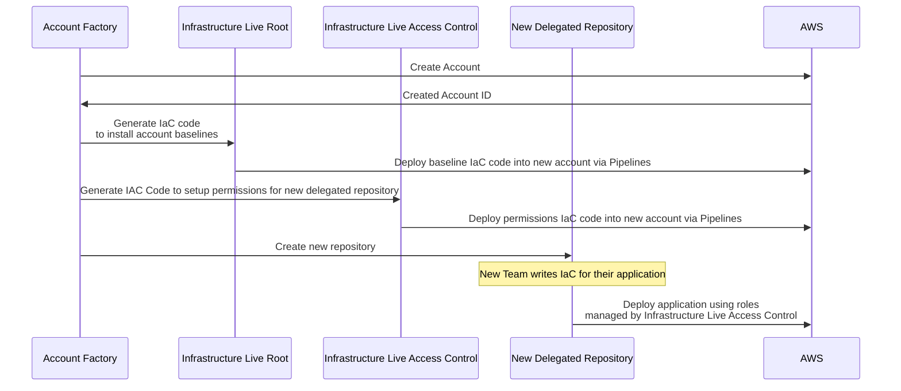

# Delegated Repositories

::: note Account Factory-created Delegated Repositories are only available to DevOps Foundations Enterprise customers.
:::

As enterprises expand their use of Infrastructure as Code (IaC) across multiple teams, the need to enforce least-privilege access control to both IaC source code and its CI/CD processes becomes increasingly important. Gruntwork recommends leveraging multiple source code repositories to establish clear boundaries that enforce least-privilege access control. 

This approach involves a structured pattern that includes: 

-  **Centralized `infrastructure-live-root` Repository**  
   Governed by the core platform team, this repository contains IaC for essential security and shared infrastructure. Examples include account creation, central logging/auditing, and networking controls (e.g., GuardDuty, SecurityHub, Macie, Transit Gateway).

-  **Team-Specific Delegated Repositories**  
   Named using a convention such as `infrastructure-live-$TEAM_NAME`, these repositories enable individual teams to manage their own IaC. The core platform team creates delegated repositories through the Account Factory. The `infrastructure-live-access-control` system controls access to these repositories, granting teams permissions specific to their infrastructure responsibilities.

By adopting this pattern, core platform teams can:

- Centrally manage compliance and security infrastructure.
- Define and enforce which teams are authorized to deploy specific types of infrastructure, ensuring alignment with architecture board-approved plans.
- Oversee shared and per-team infrastructure tags for consistency and governance.
- Enforce least-privilege access policies, restricting teams to access only the IaC and deployment capabilities necessary for their responsibilities.

## Delegated Repository Creation

Delegated repositories can be optionally created by the [Account Factory](/2.0/docs/accountfactory/concepts) as part of the account provisioning process. The workflow for vending a delegated account follows these automated steps:

