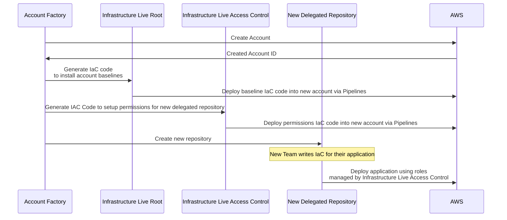

# Delegated Repositoires

:::note
Account Factory created Delegated Repositories are only available to DevOps Foundations Enterprise customers.
:::

As enterprises scale their usage of IaC across more teams there often arises a need to enforce least-privilege access control to both IaC source code and the CI/CD of that code. Gruntwork's recommendation is to leverage multiple source code repositories to create hard-boundaries that enforce least-privilege access control. The pattern we recommend consists of three parts:

1. A single `infrastructure-live-root` repository, ideally governed by the core platform team. This repository includes IaC for security and shared infrastructure including core-account creation, central logging/auditing and networking controls (e.g. GuardDuty, SecurityHub, Macie, Transit Gateway etc.).
1. Many _delegated_ repositories, often named using the pattern `infrastructure-live-$TEAM_NAME`, where individual teams can manage their own IaC. These repositories are created by the core platform team using the Account Factory and, via `infrastructure-live-access-control`, are granted limited permissions to manage their own infrastructure.
Using this pattern core platform teams have the ability to:
* Centrally manage core compliance and security infrastructure
* Centrally manage which teams have permission to deploy different types of infrastructure, allowing their team to enforce compliance with architecture-board approved plans
* Centrally manage tags for shared and per-team infrastructure
* Enforce least-privilege access to IaC, restricting teams to have access only to IaC and deployment capability / role assumptions for resources that they are responsible for.

## Delegated Repository Creation
Delegated repositories are optionally created by [Account Factory](/2.0/docs/accountfactory/concepts) during account creation.  A delegated account vend follows the following (automated) workflow:

