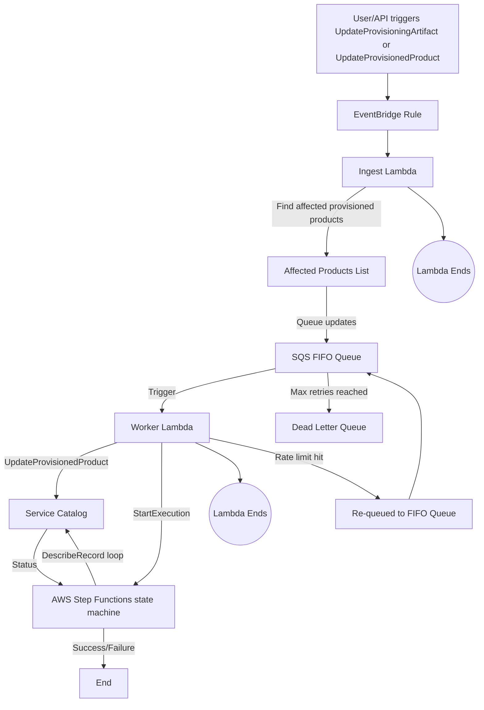

# Automatically Remediate AWS Control Tower Drift with the Async Multi-Account Factory Module

## Background: The Problem of Drift in AWS Control Tower

When managing AWS accounts via Control Tower and Service Catalog, you may encounter an issue where OpenTofu/Terraform detects drift in your infrastructure state. This is particularly common when:

- A new version of the Account Factory Provisioning Artifact is published
- You move an account between Organizational Units (OUs)
- Manual changes are made in the AWS Console or via API

In all of these cases, the `provisioned_product_id` changes behind the scenes, but OpenTofu/Terraform isn’t aware of it. When you next apply your infrastructure code, it attempts to reconcile this drift by updating every affected provisioned product, even if nothing else has changed.

This becomes a major problem at scale:

- The update process is slow, especially for large organizations
- AWS imposes a hard limit of 5 concurrent updates, so you're throttled quickly
- OpenTofu/Terraform updates can take hours to complete
- You risk timeouts, failed updates, and broken infrastructure state

## The Fix: Introducing the Async Multi-Account Factory Module

To solve this, we’ve introduced a new module: control-tower-multi-account-factory-async

Instead of managing `provisioned_product_id` drift directly via OpenTofu/Terraform, this module uses an asynchronous workflow built from AWS native services:

|Component                    | Role |
| --                          | -- |
|EventBridge Rule             | Listens for Service Catalog API calls like UpdateProvisioningArtifact and UpdateProvisionedProduct |
|Ingest Lambda                | Finds outdated provisioned products and queues them for update |
|SQS FIFO Queue               | Stores update jobs with strict ordering and deduplication |
|Worker Lambda                | Applies the update and launches Step Functions |
|AWS Step Functions state machine | Monitors the update process and confirms success or failure |


This async approach operates as follows:




Why is this better?

- Drift is resolved outside OpenTofu/Terraform
- Updates happen automatically, with no user action
- Concurrency is controlled to avoid throttling
- Your OpenTofu/Terraform applies stay fast and clean

## Step-by-Step: Switching to the Async Module

1. Update your terragrunt.hcl to use the new module

Replace this:

```hcl
terraform {
  source = "git@github.com:gruntwork-io/terraform-aws-control-tower.git//modules/landingzone/control-tower-multi-account-factory?ref=VERSION"
}
```

With this:

```hcl
terraform {
  source = "git@github.com:gruntwork-io/terraform-aws-control-tower.git//modules/landingzone/control-tower-multi-account-factory-async?ref=VERSION"
}
```

_Note: No state migration is needed — this is a drop-in replacement._

2. Update IAM Permissions

The new infrastructure created by the async module will require additional permissions be added to the roles [root-pipelines-apply-role](https://github.com/gruntwork-io/terraform-aws-architecture-catalog/blob/v3.1.2/templates/gruntwork-landing-zone/_envcommon/landingzone/root-pipelines-apply-role.hcl) and [root-pipelines-plan-role](https://github.com/gruntwork-io/terraform-aws-architecture-catalog/blob/v3.1.2/templates/gruntwork-landing-zone/_envcommon/landingzone/root-pipelines-plan-role.hcl). The necessary IAM role changes are included below and can also be found in [v3.1.2 (or later) of terraform-aws-architecture-catalog](https://github.com/gruntwork-io/terraform-aws-architecture-catalog/tree/v3.1.2/templates/gruntwork-landing-zone/_envcommon/landingzone).


For `_envcommon/landingzone/root-pipelines-apply-role.hcl`, ensure that you have at least the following permissions:

```hcl
    "EventBridgeAccess" = {
      resources = ["*"]
      actions   = ["events:*"]
      effect    = "Allow"
    }
    "LambdaDeployAccess" = {
      resources = ["*"]
      actions   = ["lambda:*"]
      effect    = "Allow"
    }
    "SQSDeployAccess" = {
      resources = ["*"]
      actions   = ["sqs:*"]
      effect    = "Allow"
    }
   "StatesDeployAccess" = {
     resources = ["*"]
     actions   = ["states:*"]
     effect    = "Allow"
   }
```

For `_envcommon/landingzone/root-pipelines-plan-role.hcl`, ensure that you have at least the following permissions:

```hcl
    "CloudWatchEventsReadOnlyAccess" = {
      effect    = "Allow"
      actions   = ["events:Describe*", "events:List*"]
      resources = ["*"]
    }
    "CloudWatchLogsReadOnlyAccess" = {
      effect = "Allow"
      actions = [
        "logs:Get*",
        "logs:Describe*",
        "logs:List*",
        "logs:Filter*",
        "logs:ListTagsLogGroup"
      ]
      resources = ["*"]
    }
    "LambdaReadOnlyAccess" = {
      effect = "Allow"
      actions = [
        "lambda:Get*",
        "lambda:List*",
        "lambda:InvokeFunction"
      ]
      resources = ["*"]
    }
    "SQSReadOnlyAccess" = {
      effect = "Allow"
      actions = [
        "sqs:Get*",
        "sqs:List*",
      ]
      resources = ["*"]
    }
   "StatesReadOnlyAccess" = {
     resources = ["*"]
     actions   = [
       "states:List*",
       "states:Describe*",
       "states:GetExecutionHistory",
       "states:ValidateStateMachineDefinition"
     ]
     effect    = "Allow"
   }
```

3. Apply your changes

Next, run `terragrunt apply` either directly or through GitHub Actions. This will deploy:

- The new Lambda functions
- SQS FIFO queue + DLQ
- EventBridge rules for Service Catalog API monitoring
- AWS Step Functions state machine

Once applied, drifted `provisioned_product_id` values will be remediated when [UpdateProvisioningArtifact](https://docs.aws.amazon.com/servicecatalog/latest/dg/API_UpdateProvisioningArtifact.html) or [UpdateProvisionedProduct](https://docs.aws.amazon.com/servicecatalog/latest/dg/API_UpdateProvisionedProduct.html) API calls occur.

_Note: If your environment is already in a drifted state, you may need to manually trigger one of these API calls. The simplest way to do this is to deactivate and reactivate the current provisioning artifact version._

## Optional: Control Concurrency with lambda_worker_max_concurrent_operations

AWS Service Catalog currently enforces a [hard limit of 5 account-related operations concurrently](https://docs.aws.amazon.com/controltower/latest/userguide/provision-and-manage-accounts.html#:~:text=You%20can%20perform%20up%20to%20five%20(5)%20account%2Drelated%20operations%20concurrently%2C%20including%20provisioning%2C%20updating%2C%20and%20enrolling.) that includes provisioning, updating, and enrolling. Exceeding this limit may result in throttling errors or failed updates.

To avoid hitting that limit (and prevent failed updates), you can configure the number of concurrent updates with the `lambda_worker_max_concurrent_operations` variable. Example:

```hcl
inputs = {
  lambda_worker_max_concurrent_operations = X # default is 4
}
```

This variable tells the worker Lambda to never initiate more than X updates at a time, which can be used to leave headroom for other processes (like provisioning new accounts) to succeed.

|Value |   Behavior |
| --   | -- |
|`5`     | Max concurrency allowed by AWS (use with caution) |
|`4`     | The default set by the async module |
|`<5`    | Safe concurrency with headroom for other ops |
|`1`     | Serialized updates, safest but slowest |
