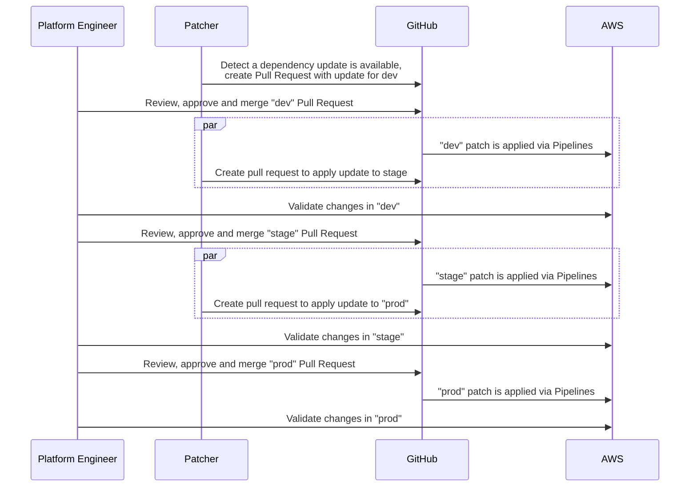

# Patcher Promotion Workflows

Before you promote an infrastructure change to production, it's natural to want to validate that change in a lower environment. We call this general process of moving changes between environments a promotion workflow.

Patcher was built with promotion workflows in mind, and this document aims to outline how to integrate that flow with GitHub Actions. Specifically, Patcher is able to detect an infrastructure change and then facilitate incorporating that change across environments (e.g., dev, stage, prod). The idea is to create a series of pull requests, each containing the relevant changes for a specific environment. These pull requests can be reviewed and tested individually. 

Once a pull request is approved, merging it using the `dispatch` action triggers the Patcher workflow, which generates a corresponding pull request for the next environment in the deployment chain. This process continues until the end of the chain, when the final pull request is merged, and no further dispatching occurs.

Patcher was explicitly built for infrastructure as code and has a first-class understanding of versioning in Terraform/OpenTofu/Terragrunt. As a result, even if your infrastructure has differences between environments, Patcher can still identify outdated modules and apply updates in a sane way through a promotion workflow.

Below is a sequence diagram walking through a hypothetical promotion workflow from `dev` to `stage` to `prod` environments

