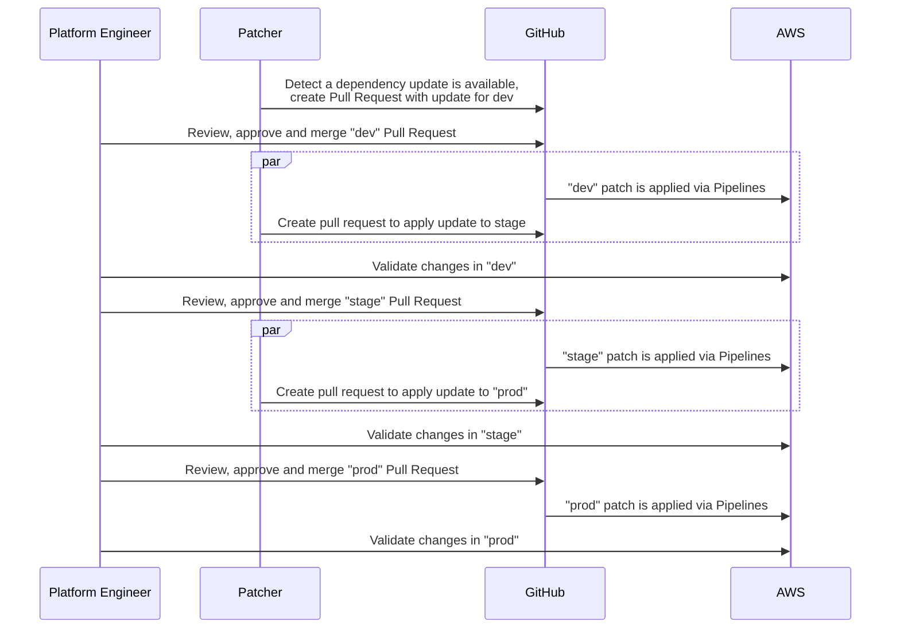

# Patcher Promotion Workflows

Before you promote an infrastructure change to production, it's natural to want to validate that change in a lower environment. We call this general process of moving changes between environments a promotion workflow.

Patcher was built with promotion workflows in mind, and this document aims to outline how to integrate that flow with GitHub Actions. Specifically, Patcher is able to detect an infrastructure change and then facilitate incorporating that change across environments (e.g. dev, stage, prod). The idea is to create a series of pull requests for your code that each include the relevant changes for a particular environment which can then be reviewed and tested. Once approved the act of merging a given pull request with "dispatch" a patcher workflow which will generate an analogous pull request on the next environment in the chain. This continues until the end of the chain at which point the final pull request is merged and no further dispatching occurs.

Patcher was built specifically for infrastructure as code and has a first-class understanding of versioning in Terraform/OpenTofu/Terragrunt. As a result, even if your infrastructure has differences between environments, Patcher is still able to identify out of date modules and apply updates in a sane way through a promotion workflow.

Below is a sequence diagram walking through a hypothetical promotion workflow from "dev" to "stage" to "prod" environments

