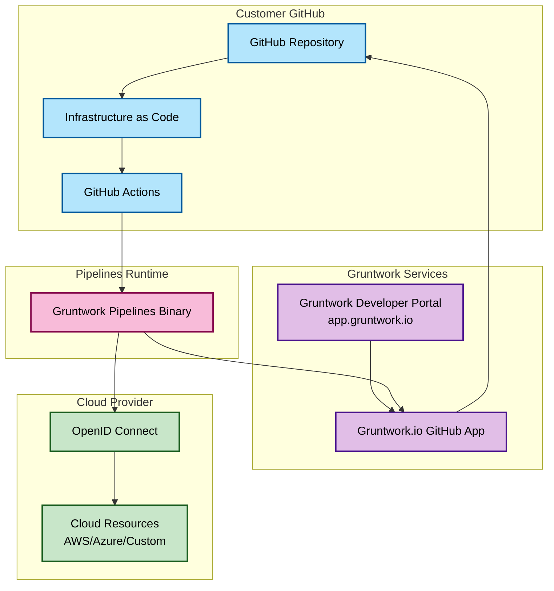
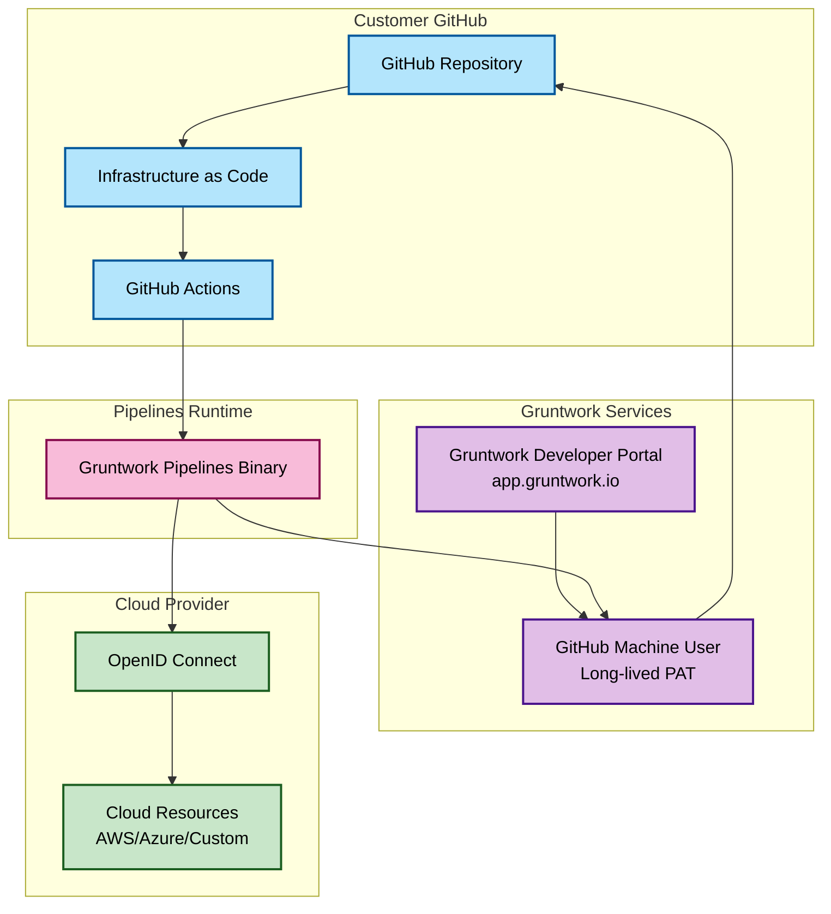
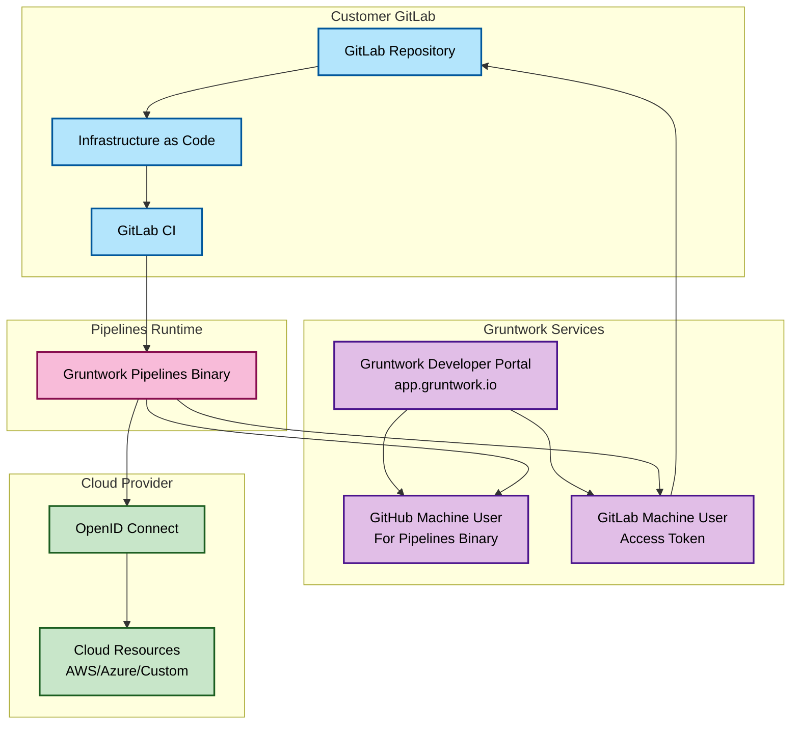

# Architecture

Gruntwork Pipelines, at its core, is a single binary that customers can download using their Gruntwork subscription to "do the right thing" when it comes to managing Infrastructure as Code using Terragrunt using GitOps workflows. Pipelines runs in customer CI/CD pipelines (not Gruntwork servers or any other dedicated server you have to maintain) to handle all the complexity of performing IaC CI/CD.

Outside of the main binary, Pipelines has several other components that work together to make it all work. These components are all provided by Gruntwork, and we work with our customers to ensure that they are configured correctly to work together.

## CI/CD pipelines

By design, customers run the binary as part of their CI/CD pipelines (e.g. GitHub Actions, GitLab CI, etc.). As such, Gruntwork provides out-of-the-box CI/CD configurations for supported platforms when customers sign up for Gruntwork Pipelines.

We likewise provide CI/CD configurations for [Gruntwork Account Factory](https://docs.gruntwork.io/account-factory/overview). 

When using Gruntwork Pipelines without Gruntwork Account Factory, customers are responsible for configuring their repositories to use the appropriate CI/CD configuration for that platform (see [Adding Pipelines to an Existing Repository](/2.0/docs/pipelines/installation/addingexistingrepo) for more information). This code is typically fairly minimal, and the majority of the work is done by reusable workflows made available by Gruntwork, and the binary itself.

## Cloud resources

For most customers, Pipelines is used to manage infrastructure resources in cloud environments. In order for Pipelines to be able to manage these resources, it needs to be able to authenticate to the cloud provider. Pipelines supports authentication out of the box for the following cloud providers:

- [AWS](/2.0/docs/pipelines/concepts/cloud-auth/aws)
- [Azure](/2.0/docs/pipelines/concepts/cloud-auth/azure)
- [Custom](/2.0/docs/pipelines/concepts/cloud-auth/custom) (build your own support for your cloud provider)

The way in which Pipelines authenticates to these cloud providers (with the exception of Custom authentication) is via OpenID Connect (OIDC).

With OIDC, Pipelines is able to generate temporary credentials for granular authentication to cloud providers, using the context of the pull request or push to the deploy branch.

e.g. When a pull request is opened, Pipelines might determine that the IaC being edited is in an [environment](/2.0/reference/pipelines/configurations-as-code#environment-blocks) that is configured to authenticate to AWS using OIDC, and generate temporary read-only credentials (as that's what's required for plans in pull requests) to authenticate with AWS using the role defined for that environment.

## SCM Authentication

In addition to authenticating to cloud providers, Pipelines also needs to be able to authenticate to Source Control Management (SCM) platforms (e.g. GitHub, GitLab) to fetch resources (e.g. IaC code, reusable CI/CD code and the Pipelines binary itself).

Pipelines supports authentication to the following SCM platforms:

- GitHub
- GitLab

The way in which Pipelines authenticates to these SCM platforms differs slightly, due to the different ways in which they support authentication, and the needs of customers.

### Gruntwork.io GitHub App Authentication

Customers using Github as their SCM platform can install the [Gruntwork.io GitHub App](https://github.com/apps/gruntwork-io) to authenticate with Github. This app provides a more feature-rich and secure experience, and is the recommended method of authentication for most customers if they can use it.

When using the Gruntwork.io GitHub App, users are able to avoid the need to provision any machine users or long-lived Personal Access Tokens (PATs) to authenticate with Github to download the Pipelines binary or access other repositories they want to access in their CI/CD pipelines. Control of the permissions the Gruntwork.io GitHub App grants when installed is done via the [Gruntwork Developer Portal](#gruntwork-developer-portal).

### GitHub Machine Users Authentication

Customers using GitHub as their SCM platform, but are unable (or don't wish to) use the Gruntwork.io GitHub App, and customers using a different SCM platform (e.g. GitLab) use GitHub Machine Users to authenticate with GitHub.

All customers must authenticate with GitHub in some way for the core requirement to download the Pipelines binary using their Gruntwork subscription. Customers that are using GitHub as their SCM platform, but aren't using the Gruntwork.io GitHub App also use GitHub Machine Users to authenticate with GitHub to download IaC code and reusable GitHub Actions code. Customers using a different SCM platform (e.g. GitLab) only use GitHub Machine Users to authenticate with GitHub to download the Pipelines binary.

### GitLab Machine Users Authentication

Customers using GitLab as their SCM platform use GitLab Machine Users to authenticate with GitLab to download reusable GitLab CI/CD code, and access other IaC repositories.

## Gruntwork Developer Portal

The Gruntwork Developer Portal (hosted at [app.gruntwork.io](https://app.gruntwork.io)) is a web-based interface that customers use to manage their Gruntwork subscription. This includes the ability to install the Gruntwork.io GitHub App and associate it with a Gruntwork organization, and manage the access that the app has to relevant GitHub resources in customer GitHub organizations.

It is also used to manage the access that GitHub Machine Users have to relevant Gruntwork owned repositories, made available via customer Gruntwork subscriptions.

## Architecture Overview

The Gruntwork Pipelines architecture varies depending on your Source Control Management (SCM) platform, authentication method, and cloud provider.

Below are simplified diagrams for each supported configuration, to provide a high-level overview of the architecture:

### GitHub with Gruntwork.io App (Recommended)

### GitHub with Machine Users

### GitLab

