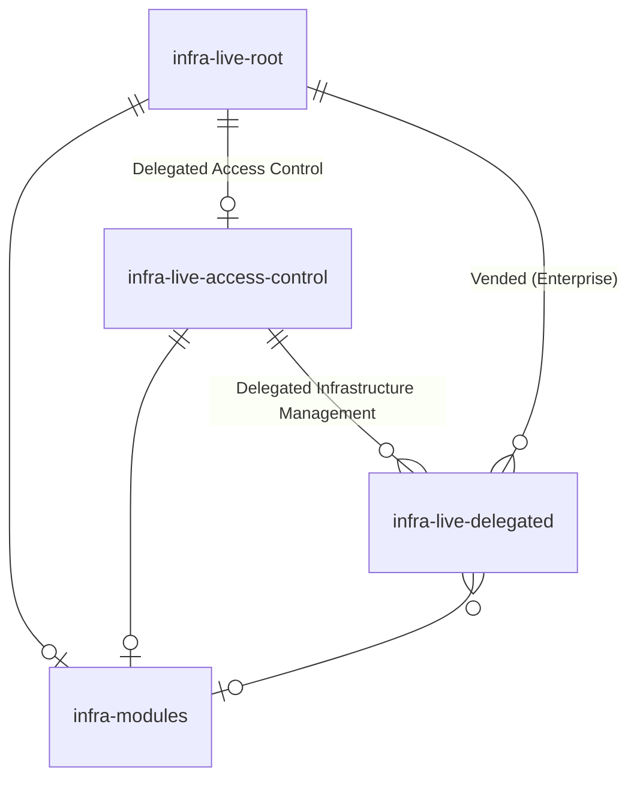

# Architecture

Gruntwork Pipelines is designed to provide flexibility, enabling you to utilize the components you need to manage your infrastructure in a way that aligns with your organization's requirements.

Understanding the components and their structure will help you use Pipelines and associated Infrastructure as Code (IaC) effectively.

## `infrastructure-live-root`

The `infrastructure-live-root` repository serves as the root of your infrastructure and is provisioned using the [infrastructure-live-root-template](https://github.com/gruntwork-io/infrastructure-live-root-template) template repository.

This repository is where you manage sensitive resources such as the Landing Zone and Organization services for AWS. Typically, access to this repository is restricted to a small group of trusted users.

All other infrastructure managed with Gruntwork software ultimately depends on resources configured in this repository.

### Workflows

- **Account Factory:** Provides an API for interacting with the Gruntwork Account Factory. It uses a [repository dispatch](https://docs.github.com/en/actions/writing-workflows/choosing-when-your-workflow-runs/events-that-trigger-workflows#repository_dispatch) to create AWS account requests.

  The workflow payload is a JSON object, which can be constructed using the sample HTML file included in the repository. This file can be customized for organizational needs, such as adding tagging fields or additional context.

- **Pipelines:** Manages infrastructure changes in a GitOps fashion. While the workflow permissions are mostly read-only for proposing changes, they include write access to apply infrastructure changes upon merging.

:::tip

The `infrastructure-live-root` repository can be renamed during the bootstrap process, but giving it a similar name to `infrastructure-live-root` is recommended for clarity when using Gruntwork documentation. Multiple root repositories can be created if needed, but this increases complexity and operational overhead.

:::

## `infrastructure-live-access-control`

The `infrastructure-live-access-control` repository manages access control for your infrastructure and is provisioned during the bootstrap process in the `infrastructure-live-root` repository. While only necessary for Enterprise customers, it is recommended for all users.

This repository handles IAM roles, policies, and permissions for delegated infrastructure management. It allows application engineers to propose access control changes, while a central platform team reviews and approves them.

### Workflows

- **Pipelines:** Provisions access control infrastructure in response to changes in the repository.

:::info

Delegated infrastructure management allows developers to manage infrastructure in a self-service fashion, balancing control and agility. Core infrastructure is typically managed centrally, while application-specific infrastructure is delegated to developers.

:::

## `infrastructure-catalog`

The `infrastructure-catalog` repository stores OpenTofu/Terraform modules created for internal use. It is optionally provisioned during the bootstrap process of the `infrastructure-live-root` repository.

This repository is optional but recommended for managing reusable infrastructure code. Customers often combine Gruntwork modules with custom modules stored here to extend functionality.

### Workflows

- **Tests:** Validates module functionality by provisioning them in real environments, running [Terratests](https://github.com/gruntwork-io/terratest), and tearing them down. This workflow ensures modules work as expected.

:::tip

While `infrastructure-catalog` can be renamed, keeping a consistent name is recommended for clarity in documentation. Multiple module repositories can be created if necessary, but consider the trade-offs between centralized and decentralized approaches.

:::

## `infrastructure-live-delegated`

Delegated repositories, referred to as `infrastructure-live-delegated`, are used for delegating infrastructure management. Permissions for these repositories are granted by the `infrastructure-live-access-control` repository.

These repositories are useful for application-specific needs, such as deploying updates to AWS ECS services or managing container images. Enterprise customers can automate the creation and management of delegated repositories using `infrastructure-live-root`.

## Entity relationship diagram

:::note

The term `infrastructure` is abbreviated as `infra` in the diagram for simplicity.

:::

The `infrastructure-live-root` repository serves as the central hub for managing all infrastructure.

- Users who choose to delegate access control can use the `infrastructure-live-root` repository to provision the necessary `pipelines-access-control` roles in AWS accounts. These roles allow access control to be managed within the `infrastructure-live-access-control` repository.

- Users who opt to delegate infrastructure management can use the `infrastructure-live-access-control` repository to provision the required `pipelines-delegated` roles in AWS accounts. These roles enable infrastructure management to be handled through `infrastructure-live-delegated` repositories.

- Users who prefer to centralize module management can utilize the `infrastructure-catalog` repository to create and maintain reusable, vetted modules. These modules can be shared across the organization and accessed by any repository as needed.
