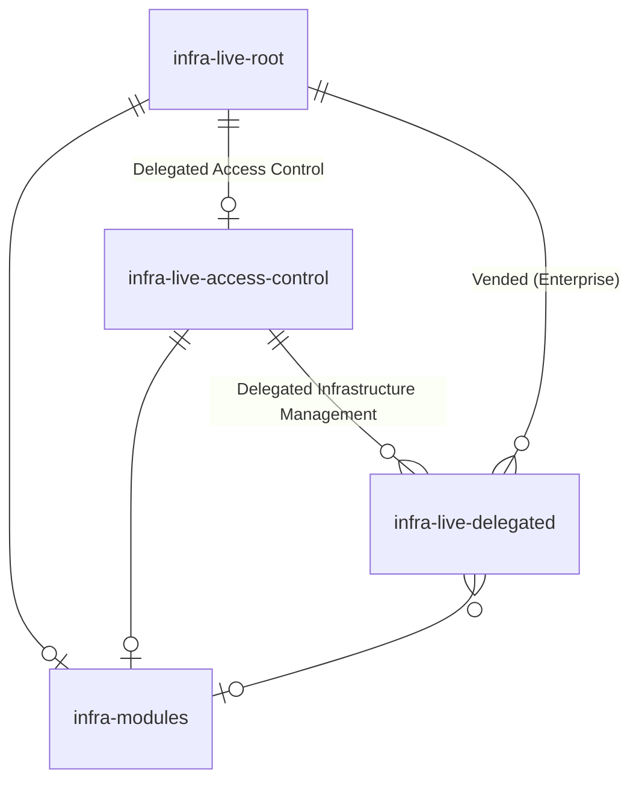

# Architecture

Gruntwork Pipelines is designed to provide flexibility, enabling you to utilize the components you need to manage your infrastructure in a way that aligns with your organization's requirements.
 

Understanding the components and their structure will help you use Pipelines and associated Infrastructure as Code (IaC) effectively.

## `infrastructure-live-root`

The `infrastructure-live-root` repository serves as the root of your infrastructure and is provisioned using the [infrastructure-live-root-template](https://github.com/gruntwork-io/infrastructure-live-root-template) template repository.

This repository is where you manage sensitive resources such as the Landing Zone and Organization services for AWS. Typically, access to this repository is restricted to a small group of trusted users.

All other infrastructure managed with Gruntwork software ultimately depends on resources configured in this repository.

### Workflows

- **Account Factory:** Provides an API for interacting with the Gruntwork Account Factory. It uses a [repository dispatch](https://docs.github.com/en/actions/writing-workflows/choosing-when-your-workflow-runs/events-that-trigger-workflows#repository_dispatch) to create AWS account requests.
  
  This workflow uses a [repository dispatch](https://docs.github.com/en/actions/writing-workflows/choosing-when-your-workflow-runs/events-that-trigger-workflows#repository_dispatch) to create a standard AWS account creation request in the repository.

  The workflow payload is a JSON object, which can be constructed using the sample HTML file included in the repository. This file can be customized for organizational needs, such as adding tagging fields or additional context.

  :::tip

  This HTML file can be customized as needed to fit the needs of your organization. You may want to add additional fields to the form for tagging purposes, or to provide additional context to the person who will be approving the account vend.

  You don't even need to use the form at all if you don't want to. An alternative would be to use a service like ServiceNow to populate the requisite fields, then trigger the workflow using the GitHub API.

  You can learn more about this [here](/2.0/docs/accountfactory/guides/vend-aws-account).

  :::

- **Pipelines:** Manages infrastructure changes in a GitOps fashion. While the workflow permissions are mostly read-only for proposing changes, they include write access to apply infrastructure changes upon merging.

:::tip

The `infrastructure-live-root` repository can be renamed during the bootstrap process, but giving it a similar name to `infrastructure-live-root` is recommended for clarity when using Gruntwork documentation. Multiple root repositories can be created if needed, but this increases complexity and operational overhead.
It also doesn't have to be the only root repository in your organization. You can have multiple root repositories if you have a complex organization structure that requires it. Make sure to evaluate the trade-offs of having multiple root repositories before doing so. It can be a significant source of complexity and operational overhead.

:::

## `infrastructure-live-access-control`

The `infrastructure-live-access-control` repository manages access control for your infrastructure and is provisioned during the bootstrap process in the `infrastructure-live-root` repository. While only necessary for Enterprise customers, it is recommended for all users.

This repository handles IAM roles, policies, and permissions for delegated infrastructure management. It allows application engineers to propose access control changes, while a central platform team reviews and approves them.

More access can be granted to this repository than the `infrastructure-live-root` repository, but it should still be treated as a sensitive resource. Organizations typically find it useful to have restrictions on who can approve and merge changes to this repository, and allow for users to propose changes in a self-service fashion. This allows for application workload engineers to propose changes to the access control their workflows need, while allowing a central platform team to review and approve those changes instead of having to author the changes themselves.

:::info

Delegated infrastructure management is the practice of allowing developers to manage infrastructure in a self-service fashion.

This is in contrast to centralized infrastructure management, where a small number of people manage all the infrastructure for the entire organization.

Organizations frequently use a combination of both centralized and delegated infrastructure management to balance the need for control and security with the need for agility and speed.

e.g. Centralized management for core infrastructure like AWS accounts, VPCs, OIDC providers and powerful IAM roles, and delegated management for application infrastructure like container images, AWS ECS services, and S3 buckets.

The exact balance will depend on your organization's needs.

:::

:::tip

The `infrastructure-live-access-control` repository does not have to be named "infrastructure-live-access-control". You can name it whatever you like. It is highly recommended that the repository is named something similar to `infrastructure-live-access-control` to make it clear what it is when reading Gruntwork documentation, however.

It also doesn't have to be the only access control repository in your organization. You can have multiple access control repositories if you have a complex organization structure that requires it. Make sure to evaluate the trade-offs of having multiple access control repositories before doing so. It can be a significant source of complexity and operational overhead. Also note that doing this will sacrifice some of the benefits of having a single source of truth for access control.

:::

### Workflows

- **Pipelines** - This workflow will be used by the `infrastructure-live-access-control` repository to manage access control infrastructure in response to changes in the repository in a GitOps fashion.

  While the permissions for this workflow are largely read-only when proposing access control changes, the workflow also has the ability to make changes to relevant access control infrastructure when the changes are merged.

## `infrastructure-catalog`

The `infrastructure-catalog` repository stores OpenTofu/Terraform modules created for internal use. It is optionally provisioned during the bootstrap process of the `infrastructure-live-root` repository.

This repository is optional but recommended for managing reusable infrastructure code. Customers often combine Gruntwork modules with custom modules stored here to extend functionality.

:::tip

While `infrastructure-catalog` can be renamed, keeping a consistent name is recommended for clarity in documentation. Multiple module repositories can be created if necessary, but consider the trade-offs between centralized and decentralized approaches.

It can be advantageous to have one repository for all modules to make it easier to find and share modules across your organization. However, it can also be advantageous to have multiple repositories if you have different teams that need to manage their own modules, or want to have different modules available to different teams within your organization.

:::

### Workflows

- **Tests:** Validates module functionality by provisioning them in real environments, running [Terratests](https://github.com/gruntwork-io/terratest), and tearing them down. This workflow ensures modules work as expected.

## `infrastructure-live-delegated`

One of the primary benefits of IaC Foundations is the streamlined delegation of infrastructure management. For the sake of discussion in Gruntwork documentation, we refer to repositories that have been granted delegated permissions to interact with infrastructure as "delegated repositories", or `infrastructure-live-delegated`. Their permissions are granted by the `infrastructure-live-access-control` repository.

These repositories can be created manually by customers for specific purposes. For example, an application repository may need permissions to build and push a container image to AWS ECR, or to deploy an update to an ECS service. These permissions can be delegated by the `infrastructure-live-access-control` repository to a specific repository that needs those permissions.

Enterprise customers can also expect the creation and management of delegated repositories centrally in the `infrastructure-live-root` repository. This is an Enterprise-only feature that allows for the creation of delegated repositories with largely the same degree of infrastructure management as the `infrastructure-live-root` repository itself. This is useful for organizations that want to allow large degrees of infrastructure management (e.g. entire AWS accounts) without having to manually provision and manage the repositories that need those permissions.
## Entity relationship diagram

:::note

The term `infrastructure` is abbreviated as `infra` in the diagram for simplicity.

:::

The `infrastructure-live-root` repository serves as the central hub for managing all infrastructure.

- Users who choose to delegate access control can use the `infrastructure-live-root` repository to provision the necessary `pipelines-access-control` roles in AWS accounts. These roles allow access control to be managed within the `infrastructure-live-access-control` repository.

- Users who opt to delegate infrastructure management can use the `infrastructure-live-access-control` repository to provision the required `pipelines-delegated` roles in AWS accounts. These roles enable infrastructure management to be handled through `infrastructure-live-delegated` repositories.

- Users who prefer to centralize module management can utilize the `infrastructure-catalog` repository to create and maintain reusable, vetted modules. These modules can be shared across the organization and accessed by any repository as needed.
