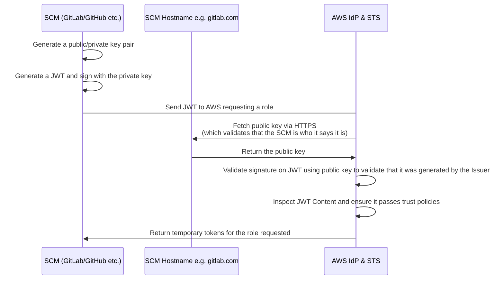
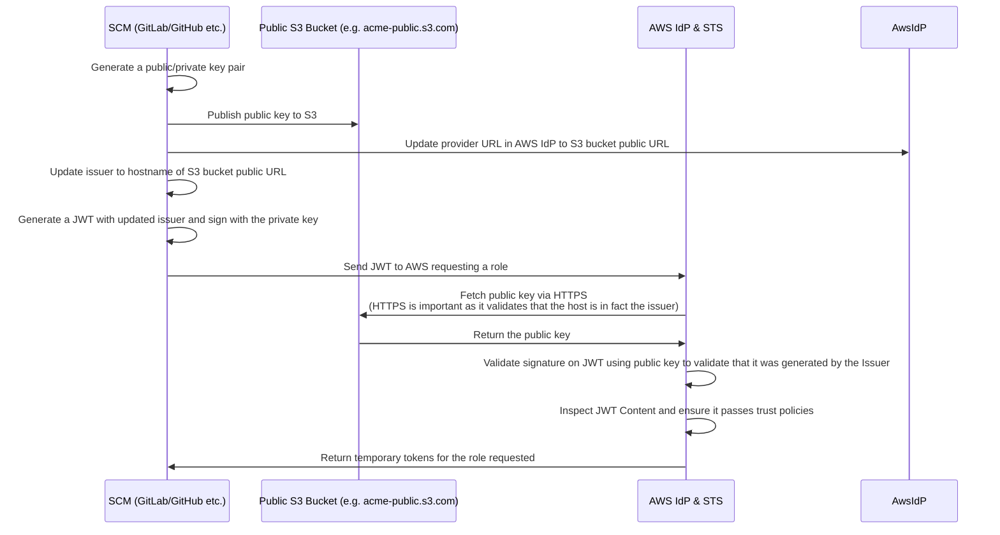

# Authenticating to AWS

import Tabs from '@theme/Tabs';
import TabItem from '@theme/TabItem';

Pipelines automatically determines which AWS account(s) to authenticate with, and how to authenticate with them, based on the infrastructure changes proposed in your pull request.

## How Pipelines authenticates to AWS

To execute the infrastructure changes detected by Pipelines, each AWS account must have an AWS IAM Role that Pipelines can assume using Open ID Connect (OIDC).

At a high level, OIDC works as follows: AWS recognizes GitHub or GitLab as an "identity provider," trusts GitHub's or GitLab's request to assume a temporary IAM Role, and then issues AWS credentials valid for the duration of the GitHub Actions or GitLab CI workflow.

When creating a new AWS account, it is necessary to update the AWS OIDC configuration to include an IAM role that GitHub or GitLab can assume. When using the [Gruntwork Account Factory](/2.0/docs/accountfactory/architecture), this update is performed automatically during the process of [vending a new AWS account](/2.0/docs/accountfactory/guides/vend-aws-account).

## How Pipelines knows what AWS principals to authenticate as

<Tabs>
<TabItem value="legacy" label="Legacy YAML Configuration" default>

For legacy YAML configurations (you are using these if you see a `.gruntwork/config.yml` file in your repository), account mappings are defined using a combination of the `accounts.yml` file at the root of your repository, and the names of top-level directories in your `infrastructure-live` repository.

Pipelines assumes that each top-level directory in your `infrastructure-live` repository corresponds to a single AWS account, excluding the directory reserved for [module defaults](/2.0/docs/library/concepts/module-defaults) (the one named `_envcommon`). Each account-mapped directory must have an entry in the account configuration. The entry should include a key matching the directory name and key/value pairs for the AWS account ID and the root user email address of the account.

For instance, the following `accounts.yml` entry maps to a directory named `my-cool-account` in your `infrastructure-live` repository:

```yml title=accounts.yml
"my-cool-account":
  "email": "my-root-account-email@example.com"
  "id": "123456789012"
```

```bash title="Infrastructure Live"
.
├── accounts.yml
├── _envcommon
│   └── services
│       └── my-app.hcl
├── my-cool-account
│   └── us-east-1
│       └── dev
│           └── database
│               └── terragrunt.hcl
```

</TabItem>
<TabItem value="modern" label="HCL">

For the modern HCL configuration, account mappings are defined using environments specified in HCL configuration files in the `.gruntwork` directory (you are using these if you see `.hcl` files in your `.gruntwork` directory).

Whenever Pipelines attempts to authenticate to AWS for a given unit, it will check to see if the unit matches any of the environments specified in your Pipelines HCL configurations. If any do, it will use the corresponding `authentication` block to determine how to authenticate to AWS.

For example, if you have the following environment configuration:

```hcl title=".gruntwork/environments.hcl"
environment "my_cool_environment" {
  filter {
    paths = ["my-cool-account/*"]
  }

  authentication {
    aws_oidc {
      account_id         = "123456789012"
      plan_iam_role_arn  = "arn:aws:iam::123456789012:role/pipelines-plan"
      apply_iam_role_arn = "arn:aws:iam::123456789012:role/pipelines-apply"
    }
  }
}
```

Pipelines will authenticate to AWS using the account with ID `123456789012` when a unit matches the filter `my-cool-account/*`. It will use the `pipelines-plan` role when pull requests are opened/updated, and the `pipelines-apply` role when pull requests are merged. The `pipelines-plan` role typically only has read permissions, while the `pipelines-apply` role typically has both read and write permissions.

Most customers prefer not to have to explicitly track the account IDs of AWS accounts in their configuration files. Instead, they prefer to leverage the `aws` block to parse an `accounts.yml` file that contains the relevant account metadata, then reference the accounts by name in their environment configurations.

For example, you could create an `accounts.yml` file like the following with your account definitions:

```yml title=accounts.yml
"my-cool-account":
  "email": "my-root-account-email@example.com"
  "id": "123456789012"
```

Then, create an `aws.hcl` file that references this `accounts.yml` file using the `aws` block:

```hcl title=".gruntwork/aws.hcl"
aws {
  accounts "all" {
    path = "accounts.yml"
  }
}
```

You can then reference these accounts in your environment configurations:

```hcl title=".gruntwork/environments.hcl"
environment "my_cool_environment" {
  filter {
    paths = ["my-cool-account/*"]
  }

  authentication {
    aws_oidc {
      account_id         = aws.accounts.all.my-cool-account.id
      plan_iam_role_arn  = "arn:aws:iam::${aws.accounts.all.my-cool-account.id}:role/pipelines-plan"
      apply_iam_role_arn = "arn:aws:iam::${aws.accounts.all.my-cool-account.id}:role/pipelines-apply"
    }
  }
}
```

```bash title="Infrastructure Live"
.
├── .gruntwork/
│   ├── aws.hcl
│   └── environments.hcl
├── accounts.yml
├── my-cool-account
│   └── us-east-1
│       └── dev
│           └── database
│               └── terragrunt.hcl
```

:::info
The HCL configuration approach provides more flexibility for complex authentication scenarios and enables the use of [Configurations as Code](/2.0/reference/pipelines/configurations-as-code/) features.
:::

</TabItem>
</Tabs>

## AWS account authentication when creating new AWS accounts

:::note

This section covers advanced topics related to Pipelines, how it differentiates between types of changes, and how it manages planning and applying changes.

For end users, only a single step is required in the CI job. Pipelines handles all additional processes automatically.

:::

Pipelines manages two main types of infrastructure-change events:

1. Adding, changing, or deleting Terragrunt files.
2. Creating new AWS accounts.

For the first type (add/change/delete Terragrunt files), Pipelines authenticates directly to the AWS account containing the affected resources. For the second type (creating new AWS accounts), Pipelines uses the Management Account.

### Management account

Gruntwork's Account Factory is built on AWS Control Tower, which requires that new AWS accounts be created through the [Control Tower Management AWS Account](https://docs.aws.amazon.com/controltower/latest/userguide/how-control-tower-works.html#what-is-mgmt).

When a new AWS account request is approved and the account is created, Pipelines generates a Pull Request containing the account baseline. Since Pipelines does not initially have access to the new AWS account, it authenticates through the Management Account to apply the baseline.

During baseline application and provisioning of the Pipelines role in the new child account, Pipelines first assumes the management account's Pipelines role. It then assumes an automatically provisioned role in the child account (a process known as [role chaining](https://docs.aws.amazon.com/IAM/latest/UserGuide/id_roles_terms-and-concepts.html)). Once Pipelines has temporary credentials in the new account, it executes a plan or apply to provision the requested resources. After the initial baseline and Pipelines role are applied, all subsequent events for that account are managed directly through the Pipelines role in the child account.

:::note

The AWS IAM Role in the Management Account must have permissions to provision new AWS accounts (via AWS Control Tower) and assume roles in all child accounts.

:::

### Child accounts

A child account in the context of Gruntwork Account Factory is an AWS account that is created by AWS Control Tower and is managed by Pipelines. It is a "child" account in that it is considered a child of the Management Account, and Pipelines will perform the initial baselining of the account by first assuming a role in the Management Account (the parent), then use that role to assume a different role in the child account.

Each child account (e.g., `dev`, `stage`, `prod`, etc.) contains an AWS IAM role that Pipelines can assume from GitHub Actions or GitLab CI using OIDC. This role is automatically provisioned during the [account baseline process](/2.0/docs/accountfactory/guides/vend-aws-account). Once the role is established in the child account, users can submit pull requests/merge requests to add, modify, or delete resources in that account.

When a pull request/merge request is created or synchronized, or when changes are pushed to the `main` branch, Pipelines detects the changes, maps them to the appropriate account, assumes the role in the child account, and executes a `terragrunt plan` (for pull requests/merge requests) or `terragrunt apply` (for pushes to `main`).

## Fundamentals of OIDC for Publicly Available and Private CI/CD platforms

### JWT Token Issuers

A JWT token is a base64-encoded JSON object that contains three parts: a header, a payload, and a signature. The header typically contains metadata about the token, such as the algorithm used to sign it. The payload contains the claims or assertions made by the issuer, such as the subject (user), audience (intended recipient), and expiration time. The signature is used to verify that the token was issued by a trusted authority and has not been tampered with.

Critically, the issuer is a URL that is both specified inside the token, and is used by consumers of the token to fetch the public key used to validate the signature of that same token. Assuming the public key is fetched via HTTPS, there is a valid trust chain that the token was in fact issued by the expected issuer and you have typical cryptographic guarantees it wasn't substituted or tampered with.

Typically the issuer is the hostname of the CI/CD platform, such as `https://gitlab.com`, and thus oidc configuration (and public keys) can be fetched from the publicly available route, `https://gitlab.com/.well-known/openid-configuration` etc.

If, however, your CI/CD platform is hosted privately, you will need to host the public key and OIDC configuration in a publicly accessible location, such as an S3 bucket, and update the issuer in your CI/CD configuration to point to that location.  The diagrams below illustrate both approaches - fetching the keys directly from your CI/CD platform via a public route, or fetching the keys from a public S3 bucket.

### Publicly Available CI/CD Platforms



### Non-Publicly Available CI/CD Platforms

This diagram follows the [recommended approach](https://docs.gitlab.com/ci/cloud_services/aws/#configure-a-non-public-gitlab-instance) from GitLab for private CI/CD platform instances.  The guidance is to host the public key in a publicly accessible S3 bucket and update the issuer in the CI/CD configuration.

A common alternative approach to re-hosting the public key and OIDC configuration is to update the application firewalls to specifically allow requests to the `.well-known/openid-configuration` endpoint and the JWKS endpoint from the AWS IdP.


