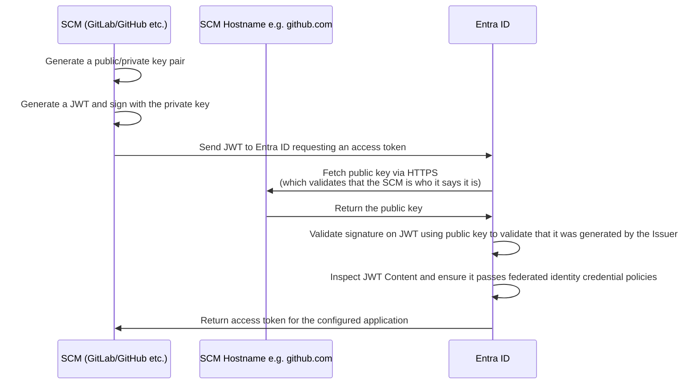
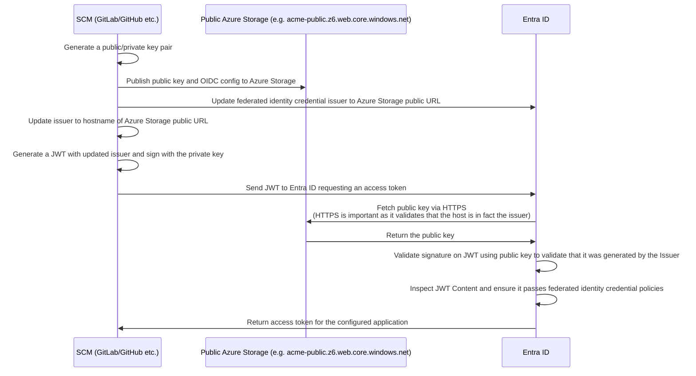

# Authenticating to Azure

Pipelines automatically determines which Azure subscription(s) to authenticate with, and how to authenticate with them, based on the infrastructure changes proposed in your pull request.

## How Pipelines authenticates to Azure

To execute the actions detected by Pipelines, each Azure subscription must have one or more Entra ID applications configured that Pipelines can authenticate with using Open ID Connect (OIDC).

At a high level, OIDC works as follows: Entra ID recognizes GitHub or GitLab as an "identity provider," trusts GitHub's or GitLab's request to authenticate with a specific Entra ID application, and then issues Azure credentials valid for the duration of the GitHub Actions or GitLab CI workflow.

When creating a new Azure subscription, it is necessary to configure Entra ID applications and federated identity credentials to enable GitHub or GitLab authentication via OIDC.

## How Pipelines knows what Azure principals to authenticate as

Azure federated identity mappings are defined using environments specified in HCL configuration files in the `.gruntwork` directory.

Whenever Pipelines attempts to authenticate to Azure for a given unit, it will check to see if the unit matches any of the environments specified in your Pipelines HCL configurations. If any do, it will use the corresponding `authentication` block to determine how to authenticate to Azure.

For example, if you have the following environment configuration:

```hcl title=".gruntwork/environments.hcl"
environment "my_azure_subscription" {
  filter {
    paths = ["my-azure-subscription/*"]
  }

  authentication {
    azure_oidc {
      tenant_id       = "a-tenant-id"
      subscription_id = "a-subscription-id"
      plan_client_id  = "plan-client-id"
      apply_client_id = "apply-client-id"
    }
  }
}
```

Pipelines will authenticate to Azure using the subscription with ID `a-subscription-id` within tenant `a-tenant-id` when the filepath of the unit matches the filter `my-azure-subscription/*`. It will use the `plan-client-id` application when pull requests are opened/updated, and the `apply-client-id` application when pull requests are merged. The plan application typically only has read permissions, while the apply application typically has both read and write permissions.

```bash title="Infrastructure Live"
.
├── .gruntwork/
│   └── environments.hcl
├── my-azure-subscription
│   └── my-azure-resource-group
│       └── database
│           └── terragrunt.hcl
```

:::info
The HCL configuration approach provides flexibility for complex authentication scenarios and enables the use of [Configurations as Code](/2.0/reference/pipelines/configurations-as-code/) features.
:::

## Azure subscription authentication workflow

Pipelines manages infrastructure changes by authenticating directly to the Azure subscription containing the affected resources using OIDC.

When a pull request is created or synchronized, or when changes are pushed to the `main` branch, Pipelines detects the changes, maps them to the appropriate Azure subscription, authenticates using the configured Entra ID application, and executes a Terragrunt plan (for pull requests) or apply (for pushes to `main`).

## Fundamentals of OIDC for Azure with GitHub Actions and GitLab CI

### Entra ID Federated Identity Credentials

Azure uses federated identity credentials to establish trust between external identity providers (like GitHub or GitLab) and Entra ID applications. This eliminates the need to store long-lived secrets in your CI/CD platform.

The federated identity credential configuration includes:

- **Issuer**: The identity provider URL (e.g., `https://token.actions.githubusercontent.com` for GitHub Actions)
- **Subject identifier**: Specifies which repository, branch, or other criteria must match for the token to be accepted (e.g., `repo:my-org/my-repo:ref:refs/heads/main`)
- **Audience**: The intended recipient of the token (typically `api://AzureADTokenExchange`)

### Publicly Available CI/CD Platforms



### Non-Publicly Available CI/CD Platforms

For private CI/CD platform instances, you have a few options to enable OIDC with Azure:

1. **Host OIDC configuration publicly**: Similar to the AWS approach, you can host the OIDC configuration (`.well-known/openid-configuration`) and JWKS (JSON Web Key Set) in a publicly accessible location, such as an Azure Storage Account with static website hosting, and update the issuer in your CI/CD configuration.

2. **Configure firewall exceptions**: Update your application firewalls to specifically allow requests to the `.well-known/openid-configuration` endpoint and the JWKS endpoint from Entra ID.

The diagram below illustrates the first approach - hosting the public key and OIDC configuration in a publicly accessible Azure Storage Account:



### Environment Variables for Azure Authentication

When Pipelines authenticates to Azure using OIDC, it provides the following environment variables to Terragrunt (and therefore OpenTofu/Terraform):

- `ARM_CLIENT_ID`: The client ID of the Azure AD application
- `ARM_TENANT_ID`: The Azure AD tenant ID
- `ARM_SUBSCRIPTION_ID`: The Azure subscription ID
- `ARM_OIDC_TOKEN`: The OIDC token provided by the CI/CD platform
- `ARM_USE_OIDC`: Set to `true` to enable OIDC authentication

The Azure provider (azurerm) uses these environment variables to authenticate directly with Entra ID using the OIDC token.
