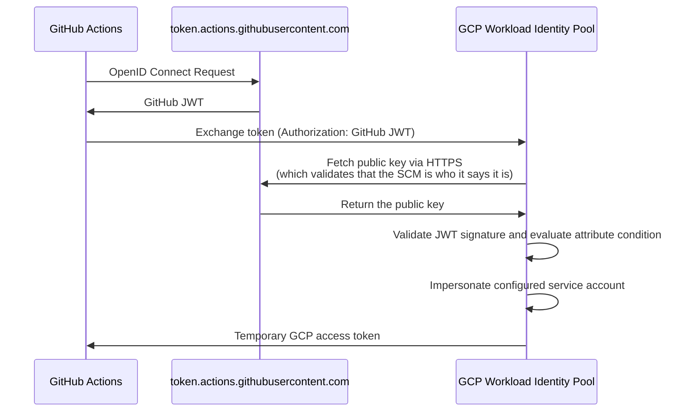
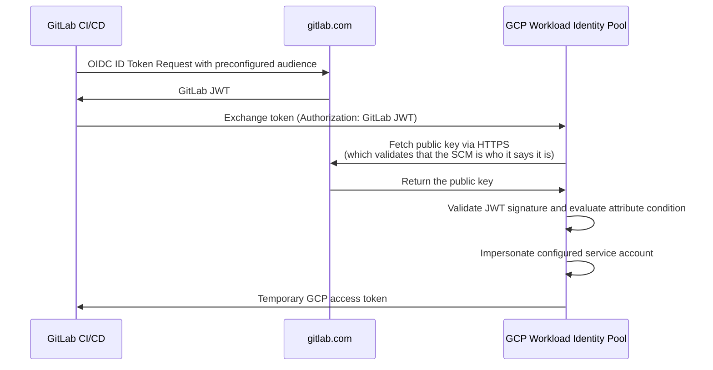
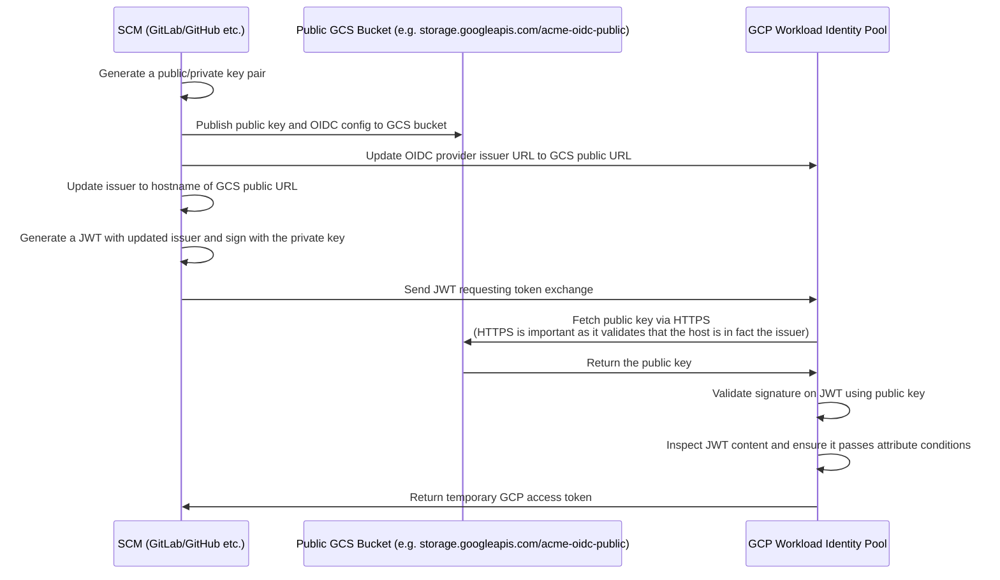

# Authenticating to GCP

import Tabs from "@theme/Tabs"
import TabItem from "@theme/TabItem"

Pipelines automatically determines which GCP project(s) to authenticate with, and how to authenticate with them, based on the infrastructure changes proposed in your pull request.

## How Pipelines authenticates to GCP

To execute the infrastructure changes detected by Pipelines, each GCP project must have a Workload Identity Pool configured with an OIDC provider that Pipelines can authenticate with.

At a high level, GCP's Workload Identity Federation works as follows: GCP's Workload Identity Pool recognizes GitHub or GitLab as an "identity provider," validates the JWT token issued by the CI/CD platform, and then issues temporary credentials valid for the duration of the GitHub Actions or GitLab CI workflow, scoped to the configured service account.

When creating a new GCP project for Pipelines, it is necessary to create a Workload Identity Pool, an OIDC provider, and two service accounts (one for plan, one for apply) with the appropriate IAM bindings. This is handled automatically by the `pipelines-bootstrap` stack in the [Gruntwork Terragrunt Scale Catalog](https://github.com/gruntwork-io/terragrunt-scale-catalog).

## How Pipelines knows what GCP principals to authenticate as

GCP Workload Identity mappings are defined using environments specified in HCL configuration files in the `.gruntwork` directory.

Whenever Pipelines attempts to authenticate to GCP for a given unit, it will check to see if the unit matches any of the environments specified in your Pipelines HCL configurations. If any do, it will use the corresponding `authentication` block to determine how to authenticate to GCP.

For example, if you have the following environment configuration:

```hcl title=".gruntwork/environments.hcl"
environment "my_gcp_project" {
  filter {
    paths = ["my-gcp-project/*"]
  }

  authentication {
    gcp_oidc {
      workload_identity_provider_id = "projects/123456789012/locations/global/workloadIdentityPools/pipelines-pool/providers/pipelines-provider"
      plan_service_account_email    = "pipelines-plan@my-gcp-project.iam.gserviceaccount.com"
      apply_service_account_email   = "pipelines-apply@my-gcp-project.iam.gserviceaccount.com"
    }
  }
}
```

Pipelines will authenticate to GCP using Workload Identity Federation when a unit matches the filter `my-gcp-project/*`. It will impersonate the `pipelines-plan` service account when pull requests are opened/updated, and the `pipelines-apply` service account when pull requests are merged. The plan service account typically only has read permissions, while the apply service account typically has both read and write permissions.

```bash title="Infrastructure Live"
.
├── .gruntwork/
│   └── environments.hcl
├── my-gcp-project
│   └── us-central1
│       └── dev
│           └── gke-cluster
│               └── terragrunt.hcl
```

:::info
The HCL configuration approach provides flexibility for complex authentication scenarios and enables the use of [Configurations as Code](/2.0/reference/pipelines/configurations-as-code/) features.
:::

## GCP project authentication workflow

Pipelines manages infrastructure changes by authenticating directly to the GCP project containing the affected resources using Workload Identity Federation.

When a pull request is created or synchronized, or when changes are pushed to the `main` branch, Pipelines detects the changes, maps them to the appropriate GCP project, exchanges the CI/CD platform's OIDC token for a short-lived GCP access token scoped to the configured service account, and executes a Terragrunt plan (for pull requests) or apply (for pushes to `main`).

## Fundamentals of OIDC for GCP with Workload Identity Federation

### Workload Identity Pool and Provider

GCP uses Workload Identity Federation to establish trust between external identity providers (like GitHub or GitLab) and GCP service accounts. This eliminates the need to create or manage service account keys.

The Workload Identity configuration includes:

- **Workload Identity Pool**: A container for external identity providers scoped to a GCP project
- **OIDC Provider**: Configures the trusted issuer URI, allowed audiences, and attribute mapping from JWT claims to GCP attributes
- **Attribute Condition**: A CEL (Common Expression Language) expression that restricts which external identities can authenticate (e.g., limiting access to a specific repository or project)
- **Service Account Binding**: Grants the external identity permission to impersonate the service account via `roles/iam.workloadIdentityUser`, using either `principal://` (single exact subject — used for apply, restricting to the deploy branch) or `principalSet://` (any identity matching an attribute filter — used for plan, allowing any branch or PR)

### Publicly Available CI/CD Platforms

<Tabs groupId="platform">
<TabItem value="github" label="GitHub" default>

GitHub Actions' OIDC issuer is `https://token.actions.githubusercontent.com`. GCP validates the JWT against this publicly available endpoint.



For more details, see [GitHub's OIDC documentation for GCP](https://docs.github.com/en/actions/deployment/security-hardening-your-deployments/configuring-openid-connect-in-google-cloud-platform).

</TabItem>
<TabItem value="gitlab" label="GitLab">

GitLab CI's OIDC issuer is `https://gitlab.com` (or your self-hosted GitLab domain). GCP validates the JWT against this publicly available endpoint.



For more details, see [GitLab's documentation on GCP integration](https://docs.gitlab.com/ee/ci/cloud_services/google_cloud/).

</TabItem>
</Tabs>

### Non-Publicly Available CI/CD Platforms

For private CI/CD platform instances, you have a few options to enable OIDC with GCP Workload Identity Federation:

1. **Host OIDC configuration publicly**: Host the OIDC configuration (`.well-known/openid-configuration`) and JWKS (JSON Web Key Set) in a publicly accessible location, such as a GCS bucket with public access, and update the issuer in your CI/CD configuration to point to that location.

2. **Configure firewall exceptions**: Update your application firewalls to specifically allow requests to the `.well-known/openid-configuration` endpoint and the JWKS endpoint from GCP's Workload Identity servers.

The diagram below illustrates the first approach — hosting the public key and OIDC configuration in a publicly accessible GCS bucket:



### Environment Variables for GCP Authentication

When Pipelines authenticates to GCP using Workload Identity Federation, it provides the following environment variable to Terragrunt (and therefore OpenTofu/Terraform):

- `GOOGLE_OAUTH_ACCESS_TOKEN`: The OAuth2 access token for the impersonated service account

The Google provider reads this environment variable to authenticate API calls without requiring a credentials file on disk.
