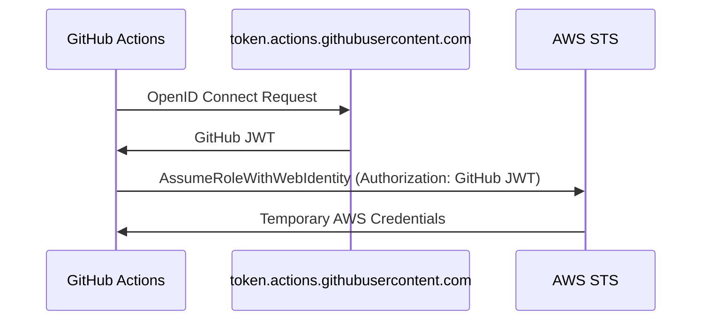

# Secrets

Continuous Integration systems often require access to sensitive resources, which necessitates the use of secrets such as API keys, passwords, or certificates. Pipelines is designed to minimize the use of long-lived secrets and instead leverages ephemeral credentials whenever possible. This approach reduces the risk of credential leaks and streamlines secret rotation.
## Authenticating with GitHub

To interact with the GitHub API, Pipelines uses either a GitHub App or Machine User [Personal Access Tokens (PATs)](https://docs.github.com/en/authentication/keeping-your-account-and-data-secure/managing-your-personal-access-tokens), depending on your installation method. For information on creating and managing these tokens, see the [Machine Users documentation](/2.0/docs/pipelines/installation/viamachineusers).

## Authenticating with AWS

Pipelines requires authentication with AWS but avoids long-lived credentials by utilizing [OIDC](https://docs.github.com/en/actions/deployment/security-hardening-your-deployments/configuring-openid-connect-in-amazon-web-services). OIDC establishes an authenticated relationship between a specific Git reference in a repository and a corresponding AWS role, enabling Pipelines to assume the role based on where the pipeline is executed.

The role assumption process operates as follows:




As a result, Pipelines avoids storing long-lived AWS credentials and instead relies on ephemeral credentials generated by AWS STS. These credentials grant least-privilege access to the resources needed for the specific operation being performed (e.g., read access during a pull request open event or write access during a merge).

## Other providers

If you are managing configurations for additional services using Infrastructure as Code (IaC) tools like Terragrunt, you may need to configure a provider for those services in Pipelines. In such cases, you must supply the necessary credentials for authenticating with the provider. Whenever possible, follow the same principles applied to AWS: use ephemeral credentials, grant only the minimum permissions required, and avoid storing long-lived credentials on disk.

### Configuring providers in Terragrunt

For example, consider configuring the [Cloudflare Terraform provider](https://registry.terraform.io/providers/cloudflare/cloudflare/latest/docs). This provider supports multiple authentication methods to enable secure API calls to Cloudflare services. To authenticate with Cloudflare and manage the associated credentials securely, you need to configure your `terragrunt.hcl` file appropriately.

First, examine the default AWS authentication provider setup in the root `terragrunt.hcl` file:


```hcl
generate "provider" {
  path      = "provider.tf"
  if_exists = "overwrite_terragrunt"
  contents  = <<EOF
provider "aws" {
  region = "${local.aws_region}"
  # Only these AWS Account IDs may be operated on by this template
  allowed_account_ids = ["${local.account_id}"]
  # tags
  default_tags {
    tags = ${jsonencode(local.tags)}
  }
}
EOF
}
```

This provider block is dynamically generated during the execution of any `terragrunt` command and supplies the AWS provider with the required configuration to discover credentials made available by the pipelines.

With this approach, no secrets are written to disk. Instead, the AWS provider dynamically retrieves secrets at runtime.

According to the Cloudflare documentation, the Cloudflare provider supports several authentication methods. One option involves using the [api_token](https://registry.terraform.io/providers/cloudflare/cloudflare/latest/docs#api_key) field in the `provider` block, as illustrated in the documentation:

```hcl
generate "cloudflare_provider" {
  path      = "cloudflare-provider.tf"
  if_exists = "overwrite_terragrunt"
  contents  = <<EOF
provider "cloudflare" {
  api_token = var.cloudflare_api_token
}
EOF
}
```

To populate the `var.cloudflare_api_token` for the provider, you must include a `variable "cloudflare_api_token" {}` block within a `.tf` file that is committed to the repository. Additionally, the `TF_VAR_cloudflare_api_token` environment variable needs to be set to the corresponding Cloudflare API token value. 

A straightforward method for achieving this is by using the `inputs` attribute in `terragrunt.hcl` files to assign the `cloudflare_api_token` variable a value derived from the `CLOUDFLARE_API_TOKEN` environment variable.

```hcl
inputs = {
  cloudflare_api_token = "${run_cmd("--terragrunt-quiet", "./fetch-cloudflare-api-token.sh")}"
}
```

:::note
In this context, `fetch-cloudflare-api-token.sh` is a script designed to retrieve the Cloudflare API token from a secret store and output it to stdout.

You are free to use any method to fetch the secret, provided it outputs the value to stdout.

Here are two straightforward examples of how you might fetch the secret:

1. Using `aws secretsmanager`:

   ```bash
   aws secretsmanager get-secret-value --secret-id cloudflare-api-token --query SecretString --output text
   ```

2. Using `aws ssm`:

   ```bash
   aws ssm get-parameter --name cloudflare-api-token --query Parameter.Value --output text --with-decryption
   ```

Given that Pipelines is already authenticated with AWS for interacting with state, this setup provides a convenient method for retrieving the Cloudflare API token.

:::

Alternatively, note that the `api_token` field is optional. Similar to the AWS provider, you can use the `CLOUDFLARE_API_TOKEN` environment variable to supply the API token to the provider at runtime.

To achieve this, you can update the `provider` block as follows:

```hcl
generate "cloudflare_provider" {
  path      = "cloudflare-provider.tf"
  if_exists = "overwrite_terragrunt"
  contents  = <<EOF
provider "cloudflare" {}
EOF
}
```

To ensure the `CLOUDFLARE_API_TOKEN` environment variable is set in the environment before Terragrunt invokes OpenTofu/Terraform, configure the `terraform` block in your `terragrunt.hcl` file as follows:


```hcl
terraform {
  extra_arguments "env_vars" {
    commands = ["apply", "plan"]

    env_vars = {
      CLOUDFLARE_API_TOKEN = "${run_cmd("--terragrunt-quiet", "./fetch-cloudflare-api-token.sh")}"
    }
  }
}
```
### Managing secrets

When configuring providers and Pipelines, it’s important to store secrets in a secure and accessible location. Several options are available for managing secrets, each with its advantages and trade-offs.

#### GitHub Secrets

GitHub Secrets is the simplest option for storing secrets and is natively supported in GitHub Actions. Refer to GitHub’s [documentation on using secrets in GitHub Actions](https://docs.github.com/en/actions/security-guides/using-secrets-in-github-actions) for guidance on setting and using secrets.

**Advantages**:
- Easy to configure and use within GitHub Actions workflows.
- No additional infrastructure or external services required.

**Trade-offs**:
- Secrets are available to all workflows without granular authorization.
- Editing workflows may be required to access these secrets securely.

#### AWS Secrets Manager

AWS Secrets Manager offers a sophisticated solution for managing secrets. It allows for provisioning secrets in AWS and configuring fine-grained access controls through AWS IAM. It also supports advanced features like secret rotation and access auditing.

**Advantages**:
- Granular access permissions, ensuring secrets are only accessible when required.
- Support for automated secret rotation and detailed access auditing.

**Trade-offs**:
- Increased complexity in setup and management.
- Potentially higher costs associated with its use.

Refer to the [AWS Secrets Manager documentation](https://docs.aws.amazon.com/secretsmanager/latest/userguide/intro.html) for further details.

#### AWS SSM Parameter Store

AWS SSM Parameter Store is a simpler and more cost-effective alternative to Secrets Manager. It supports secret storage and access control through AWS IAM, providing a basic solution for managing sensitive data.

**Advantages**:
- Lower cost compared to Secrets Manager.
- Granular access control similar to Secrets Manager.

**Trade-offs**:
- Limited functionality compared to Secrets Manager, such as less robust secret rotation capabilities.

Refer to the [AWS SSM Parameter Store documentation](https://docs.aws.amazon.com/systems-manager/latest/userguide/systems-manager-parameter-store.html) for additional information.

#### Deciding on a secret store

When selecting a secret store, consider the following key factors:

1. **Cost**: Evaluate the financial implications of using a particular secret store.
2. **Complexity**: Assess how straightforward it is to set up and manage secrets.
3. **Granularity**: Determine the level of access control the store offers.

Choose a secret store that aligns with your organization’s security, operational, and budgetary requirements. Collaborate with relevant stakeholders to ensure the selected option meets your organizational needs effectively.
