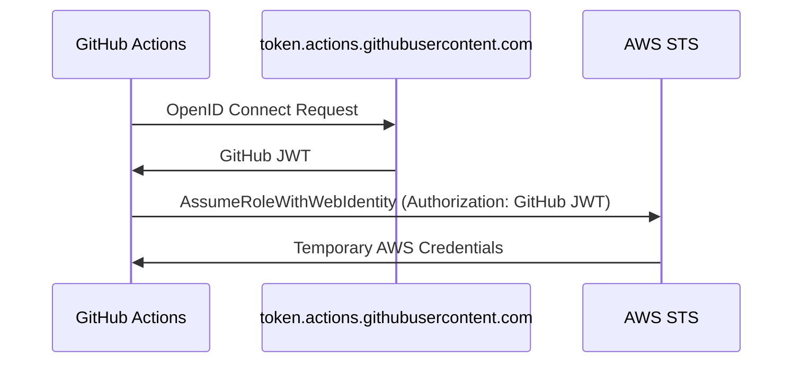

# Secrets

Continuous Integration systems frequently need access to sensitive resources, and as a consequence, they also frequently
need access to secrets to authenticate to those resources. These secrets can be anything from API keys to passwords to
certificates.

The current design in Pipelines is to minimize the number of secrets that have to be used, and to leverage ephemeral
credentials whenever possible. This is done to minimize the risk of long lived secrets being leaked, and to make it
easier to rotate secrets when necessary.

The only long lived credentials that you are required to create, rotate and maintain to use Pipelines are the
credentials used to authenticate as your [GitHub Machine users](../installation/viamachineusers.md). We are constantly looking for ways
to improve the security posture of Pipelines, and are actively working on ways to reduce even this minimal requirement.

## Authenticating With GitHub

To authenticate with GitHub, Pipelines uses either a GitHub App or Machine User [Personal Access Tokens (PATs)](https://docs.github.com/en/authentication/keeping-your-account-and-data-secure/managing-your-personal-access-tokens) (depending on how you installed Pipelines) to authenticate and interact with the GitHub API. You can
learn more about how these tokens are created and managed in the [Machine Users](../installation/viamachineusers.md) documentation.

## Authenticating With AWS

At a minimum, Pipelines also needs to authenticate with AWS. It does not do so with long lived credentials, however.
Instead, it leverages [OIDC to authenticate with AWS](https://docs.github.com/en/actions/deployment/security-hardening-your-deployments/configuring-openid-connect-in-amazon-web-services). OIDC allows for an authenticated relationship to be defined between
a particular git reference in a particular repository with a particular role in AWS, allowing pipelines to assume a role
simply by virtue of where that pipeline is run.

The process for this role assumption looks like the following:



As a consequence, Pipelines does not need to store any long lived AWS credentials, and can instead rely on the ephemeral
credentials that are generated by AWS STS that grant least privilege access to the resources required for the operation
it is engaging in (e.g. read access during PR open and write access during PR merge).

## Other Providers

If you are managing the configuration for other services in IAC, using Terragrunt, you may need to configure a provider
for that service in Pipelines. In that case, you will need to provide the necessary credentials to authenticate with
that provider. We recommend that whenever possible, use the same principles as we do with AWS, and leverage ephemeral
credentials to authenticate with the provider, granting least privilege access to the resources required for the
operation and avoid writing long lived credentials to disk.

### Configuring Providers in Terragrunt

For example, let's say you are configuring the [CloudFlare Terraform provider](https://registry.terraform.io/providers/cloudflare/cloudflare/latest/docs).

There are multiple methods of authentication supported by CloudFlare in this provider to allow you to make authenticated
API calls to CloudFlare services. How should you configure your `terragrunt.hcl` file to authenticate with CloudFlare,
and how should you manage the credentials required for Terragrunt to access these secrets safely?

First, take a look at the provider generated by default in the root `terragrunt.hcl` file for AWS authentication:

```hcl
generate "provider" {
  path      = "provider.tf"
  if_exists = "overwrite_terragrunt"
  contents  = <<EOF
provider "aws" {
  region = "${local.aws_region}"
  # Only these AWS Account IDs may be operated on by this template
  allowed_account_ids = ["${local.account_id}"]
  # tags
  default_tags {
    tags = ${jsonencode(local.tags)}
  }
}
EOF
}
```

This provider block is generated on the fly whenever a `terragrunt` command is run, and provides the necessary
configuration for the AWS provider to discover the credentials that have been made available to the environment by
the [configure-aws-credentials](https://github.com/aws-actions/configure-aws-credentials) GitHub Action.

No secrets are written to disk to support this, and secrets are discovered at runtime by the AWS provider.

Looking at CloudFlare documentation, there are multiple methods of authenticating the CloudFlare provider, including the
use of the [api_token](https://registry.terraform.io/providers/cloudflare/cloudflare/latest/docs#api_key) field in the `provider` block, as shown in the documentation:

```hcl
generate "cloudflare_provider" {
  path      = "cloudflare-provider.tf"
  if_exists = "overwrite_terragrunt"
  contents  = <<EOF
provider "cloudflare" {
  api_token = var.cloudflare_api_token
}
EOF
}
```

Populating this `var.cloudflare_api_token` for the provider requires having a `variable "cloudflare_api_token" {}`
block in a `.tf` file that is checked into the repository, and setting the `TF_VAR_cloudflare_api_token` environment
variable set to the value of the CloudFlare API token. The easiest way to do this is to leverage the `inputs` value
in `terragrunt.hcl` files to set the value of the `cloudflare_api_token` variable to the value
of the `CLOUDFLARE_API_TOKEN`

```hcl
inputs = {
  cloudflare_api_token = "${run_cmd("--terragrunt-quiet", "./fetch-cloudflare-api-token.sh")}"
}
```

:::note
Here, `fetch-cloudflare-api-token.sh` is a script that fetches the CloudFlare API token from a secret store and prints it to stdout.

You can use whatever you like to fetch the secret, as long as it prints the secret to stdout.

Two simple examples of how you might fetch the secret are:

1. Using `aws secretsmanager`:

   ```bash
   aws secretsmanager get-secret-value --secret-id cloudflare-api-token --query SecretString --output text
   ```

2. Using `aws ssm`:

   ```bash
   aws ssm get-parameter --name cloudflare-api-token --query Parameter.Value --output text --with-decryption
   ```

Given that you are already authenticated with AWS in Pipelines for the sake of interacting with state,
this can be a convenient mechanism for fetching the CloudFlare API token.

:::

Alternatively, note that the `api_token` is an optional value, and in a manner similar to that of the AWS provider,
you can use the `CLOUDFLARE_API_TOKEN` environment variable instead to provide the API token to the provider at runtime.

To use that, you can modify the `provider` block to look like the following:

```hcl
generate "cloudflare_provider" {
  path      = "cloudflare-provider.tf"
  if_exists = "overwrite_terragrunt"
  contents  = <<EOF
provider "cloudflare" {}
EOF
}
```

To have the `CLOUDFLARE_API_TOKEN` environment variable set in the environment, before Terragrunt invokes
OpenTofu/Terraform, you'll want to make sure that your `terraform` block in the `terragrunt.hcl` file looks something
like the following:

```hcl
terraform {
  extra_arguments "env_vars" {
    commands = ["apply", "plan"]

    env_vars = {
      CLOUDFLARE_API_TOKEN = "${run_cmd("--terragrunt-quiet", "./fetch-cloudflare-api-token.sh")}"
    }
  }
}
```

### Managing Secrets

Now that you have the configurations set for the provider, you'll want to make sure that the secrets are placed in a
secure and convenient location. There are many ways to store secrets, and trade-offs inherent in each method.

#### GitHub Secrets

This is the simplest way to store secrets, and is accessible by default when working with GitHub Actions. You can
follow GitHub documentation on [using secrets in GitHub Actions](https://docs.github.com/en/actions/security-guides/using-secrets-in-github-actions)
to learn more about how to store and use secrets in GitHub Actions.

The trade-offs of using GitHub Secrets for secrets management in Pipelines is that workflows have to be edited to access
them, and that there isn't granular authorization for accessing those secrets. This means that the secrets are available
when running any infrastructure update.

#### AWS Secrets Manager

This is a more sophisticated way to store secrets, and requires that you provision requisite secrets in AWS, then
configure the necessary permissions to access those secrets by the role used by Pipelines to interact with them.

Permission can be granted at a fairly granular level so that access is only granted to the secrets when necessary.

Secrets manager also has fairly sophisticated mechanisms for rotating secrets, and for auditing access to secrets.

The trade-offs for using AWS Secrets Manager are that it requires added complexity in secrets management, and that
there can be significant costs associated with using Secrets Manager.

For more on how to use AWS Secrets Manager, you can refer to the [AWS Secrets Manager documentation](https://docs.aws.amazon.com/secretsmanager/latest/userguide/intro.html).

#### AWS SSM Parameter Store

This is another secret store provided by AWS, and is a simpler and cheaper alternative to Secrets Manager.

Permissions are granted in a similar fashion to Secrets Manager (via AWS IAM), and can be granted at a fairly
granular level.

The trade-offs for using AWS SSM Parameter Store are that it is less sophisticated than Secrets Manager, and that
it has less built-in support for rotating secrets, etc.

For more on how to use AWS SSM Parameter Store, you can refer to the [AWS SSM Parameter Store documentation](https://docs.aws.amazon.com/systems-manager/latest/userguide/systems-manager-parameter-store.html).

#### Deciding on a Secret Store

When deciding on a secret store, you should prioritize considering at least the following:

1. **Cost**: How much does it cost to store secrets in the secret store?
2. **Complexity**: How complex is it to manage secrets in the secret store?
3. **Granularity**: How granular can you get with permissions for accessing secrets?

There are many more considerations that have to be evaluated based on the needs of your organization. Make sure you
have a clear understanding of what you need from a secret store before deciding on one, and make sure you coordinate
with all relevant stakeholders to ensure that the secret store you choose meets the needs of your organization.